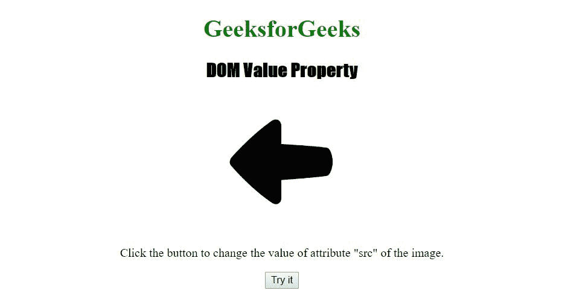
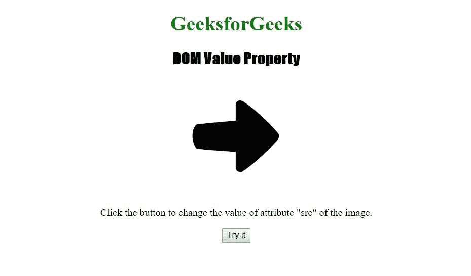

# HTML | DOM 值属性

> 原文:[https://www.geeksforgeeks.org/html-dom-value-property/](https://www.geeksforgeeks.org/html-dom-value-property/)

HTML 中的 **DOM 值属性**用于设置或返回任意属性的值。
**语法:**

*   它返回属性值。

```html
attribute.value
```

*   它用于为属性设置一个值。

```html
attribute.value = value
```

**属性值:**

*   **值:**定义属性的值。

**返回值:**返回代表属性值的字符串值。

下面程序举例说明了 HTML 中的 DOM 值属性:
**示例:**

## 超文本标记语言

```html
<!DOCTYPE html>
<html>
    <head>
        <title>
            DOM Value Property
        </title>

        <!-- script to change property value -->
        <script>
            function myFunction() {
                var x = document.getElementsByTagName("IMG")[0];
                x.getAttributeNode("src").value =
"https://media.geeksforgeeks.org/wp-content/uploads/icon1.png";
            }
        </script>
    </head>

    <body style = "text-align:center">

        <h1 style = "color:green;">
            GeeksforGeeks
        </h1>

        <h2>DOM Value Property</h2>

        

<p>
           Click the button to change the value
           of attribute "src" of the image.
        </p>

        <!-- Button to change DOM value property -->
        <button onclick = "myFunction()">
            Try it
        </button>
    </body>
</html>                          
```

之前点击按钮:



点击按钮后:



**支持的浏览器:***DOM value 属性*支持的浏览器如下:

*   谷歌 Chrome
*   微软公司出品的 web 浏览器
*   火狐浏览器
*   歌剧
*   旅行队