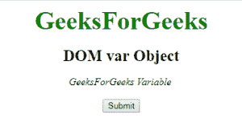
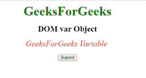
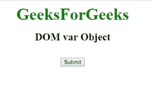
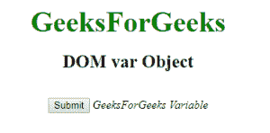

# HTML| DOM 变量对象

> 原文:[https://www.geeksforgeeks.org/html-dom-variable-object/](https://www.geeksforgeeks.org/html-dom-variable-object/)

**DOM 变量对象**用于表示 HTML <变量>元素。var 元素由 getElementById()访问。

**语法:**

```html
var element = document.getElementById("ID");

Where “id” is the ID assigned to the “var” tag.

```

**示例-1:**

```html
<!DOCTYPE html>
<html>

<head>
    <title>var tag</title>
</head>
<style>
    body {
        text-align: center;
    }

    .sudo {
        font-size: 40px;
        font-weight: bold;
        color: green;
    }

    .geeks {
        font-size: 25px;
        font-weight: bold;
    }
</style>

<body>
    <div class="sudo">GeeksForGeeks</div>
    <div class="geeks">DOM var Object</div>
    <var id="GFG">GeeksforGeeks Variable</var>
    <br>
    <br>
    <button onclick="myGeeks()">Submit</button>
    <script>
        function myGeeks() {
            var g = document.getElementById("GFG");
            g.style.color = "red";
            g.style.fontSize = "25px";
        }
    </script>
</body>

</html>
```

**输出:**

*   **点击按钮前:**
    
*   **点击按钮后:**
    

**示例-2:** 可以使用**文档创建元素方法创建变量对象。**

```html
<!DOCTYPE html>
<html>

<head>
    <title>var tag</title>
</head>
<style>
    body {
        text-align: center;
    }

    .sudo {
        font-size: 40px;
        font-weight: bold;
        color: green;
    }

    .geeks {
        font-size: 25px;
        font-weight: bold;
    }
</style>

<body>
    <div class="sudo">GeeksForGeeks</div>
    <br>
    <div class="geeks">DOM var Object</div>
    <br>
    <br>
    <button onclick="myGeeks()">Submit</button>
    <script>
        function myGeeks() {
            var g = document.createElement("VAR");
            var text = document.createTextNode("GeeksForGeeks Variable");
            g.appendChild(text);
            document.body.appendChild(g);
        }
    </script>
</body>

</html>               
```

**输出:**

*   **点击按钮前:**
    
*   **点击按钮后:**
    

**支持的浏览器:****DOM var 对象**支持的浏览器如下:

*   谷歌 Chrome
*   微软公司出品的 web 浏览器
*   火狐浏览器
*   歌剧
*   旅行队