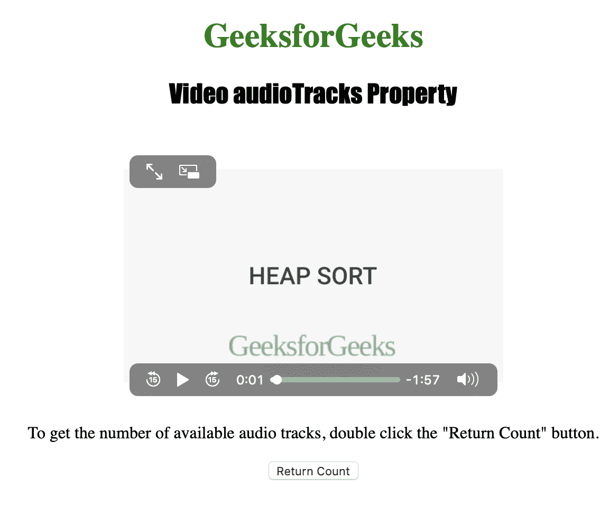
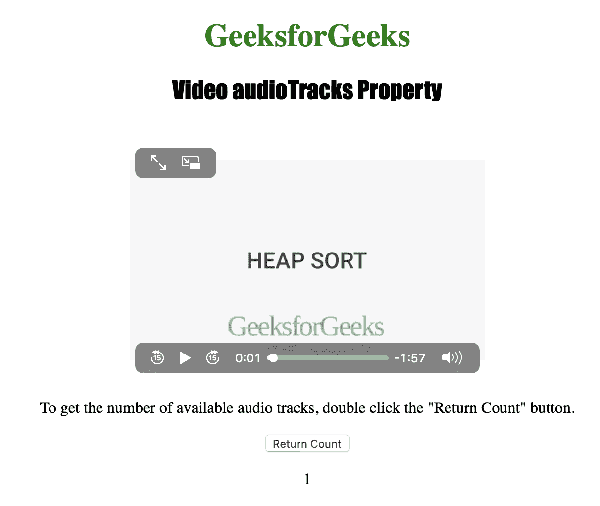

# HTML | DOM 视频音频轨道属性

> 原文:[https://www . geesforgeks . org/html-DOM-video-audio tracks-property/](https://www.geeksforgeeks.org/html-dom-video-audiotracks-property/)

**视频音轨属性**用于*返回音轨列表对象*。视频可用的音频轨道由音频轨道列表对象表示。
音频轨道对象用于表示可用的音频轨道。

**语法**

```html
videoObject.audioTracks
```

下面的程序说明了视频音频轨道属性:
**示例:**获取可用音频轨道的数量。

```html
<!DOCTYPE html>
<html>

<head>
    <title>
      Video audioTracks Property in HTML
    </title>
    <style>
        h1 {
            color: green;
        }

        h2 {
            font-family: Impact;
        }

        body {
            text-align: center;
        }
    </style>
</head>

<body>

    <h1>
      GeeksforGeeks
    </h1>
    <h2>
      Video audioTracks Property
    </h2>
    <br>

    <video id="Test_Video" 
           width="360"
           height="240" 
           controls>

        <source src="samplevideo.mp4" 
                type="video/mp4">

        <source src="movie.ogg" 
                type="video/ogg">
    </video>

    <p>
      To get the number of available audio tracks, 
      double click the "Return Count" button.
    </p>

    <button ondblclick="My_Video()">
      Return Count
    </button>

    <p id="test"></p>

    <script>
        function My_Video() {
            var v = 
                document.getElementById(
                  "Test_Video").audioTracks.length;

            document.getElementById(
              "test").innerHTML = v;
        }
    </script>

</body>

</html>
```

**输出:**

*   点击按钮前:
    
*   点击按钮后:
    

**支持的浏览器:**主要浏览器不支持 *HTML | DOM 视频音轨属性*。