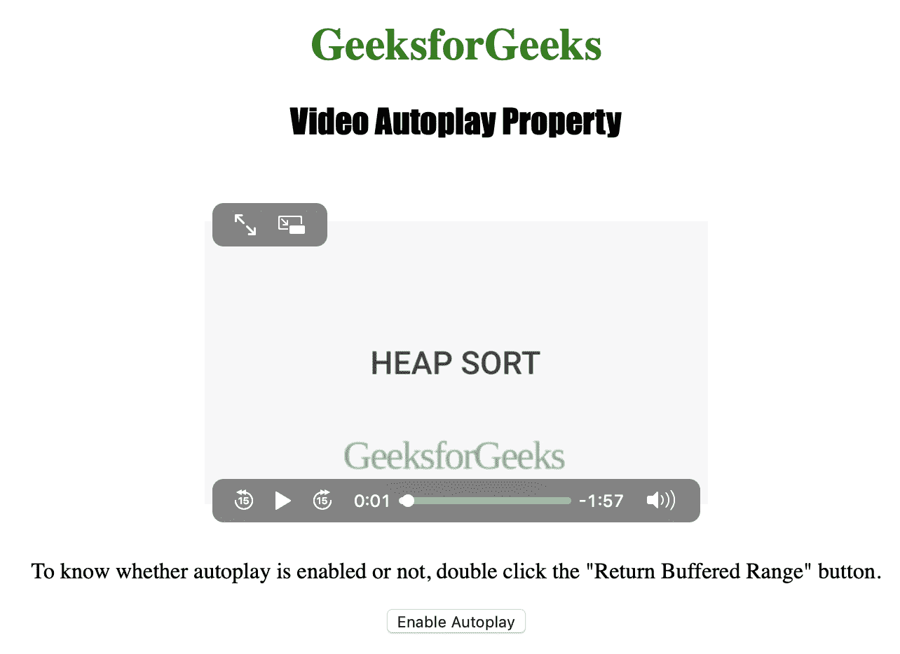
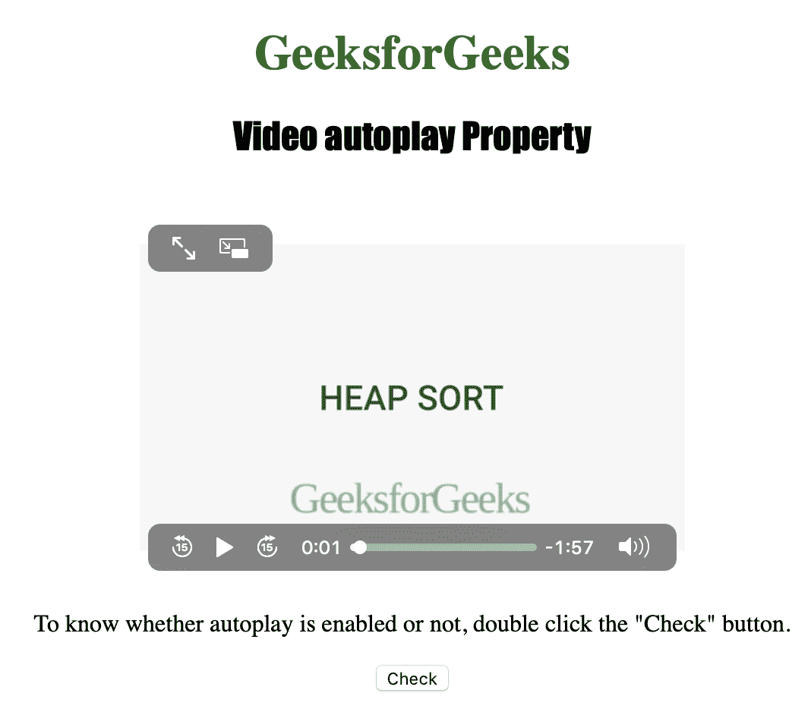
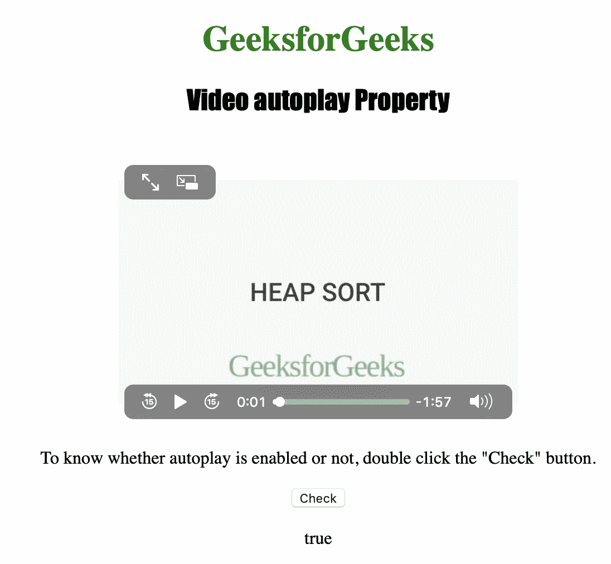

# HTML | DOM 视频自动播放属性

> 原文:[https://www . geesforgeks . org/html-DOM-video-autoplay-property/](https://www.geeksforgeeks.org/html-dom-video-autoplay-property/)

**视频自动播放属性**用于**设置**或**返回** *视频是否一加载就开始播放*。
可以用来指定视频一加载就自动开始播放。

**语法:**

*   要返回自动播放属性:

    ```html
    videoObject.autoplay
    ```

    *   To set the autoplay property:

    ```html
    videoObject.autoplay = true|false
    ```

    **属性值:**

    *   **true|false :** 用于指定视频是否一加载就自动开始播放。

    **返回值:**返回一个布尔值，当视频自动开始播放时返回 true，否则返回 false

    以下程序说明了视频自动播放属性:

    **示例-1:** 启用视频自动播放。

    ```html
    <!DOCTYPE html>
    <html>

    <head>
        <title>
          Video Autoplay Property in HTML
        </title>
        <style>
            h1 {
                color: green;
            }

            h2 {
                font-family: Impact;
            }

            body {
                text-align: center;
            }
        </style>
    </head>

    <body>

        <h1>
          GeeksforGeeks
        </h1>
        <h2>
          Video Autoplay Property
        </h2>
        <br>

        <video id="Test_Video" 
               width="360" 
               height="240"
               controls>

            <source src="samplevideo.mp4" 
                    type="video/mp4">
            <source src="movie.ogg" 
                    type="video/ogg">
        </video>

        <p>
          To know whether autoplay is enabled or not
          , double click the "Return Buffered Range" button.
        </p>

        <button ondblclick="My_Video()"
                type="button">
          Enable Autoplay
        </button>

        <p id="test"></p>

        <script>
            function My_Video() {
                v.autoplay = true;
                v.load();
            }
        </script>

    </body>

    </html>
    ```

    **输出:**
    

    **示例-2:** 一准备好视频就开始播放。

    ```html
    <!DOCTYPE html>
    <html>

    <head>
        <title>
          Video autoplay Property in HTML
        </title>
        <style>
            h1 {
                color: green;
            }

            h2 {
                font-family: Impact;
            }

            body {
                text-align: center;
            }
        </style>
    </head>

    <body>

        <h1>GeeksforGeeks</h1>
        <h2>Video autoplay Property</h2>
        <br>

        <video id="Test_Video"
               width="360"
               height="240"
               controls autoplay>

            <source src="samplevideo.mp4"
                    type="video/mp4">
            <source src="movie.ogg" 
                    type="video/ogg">
        </video>

        <p>
          To know whether autoplay is enabled or not,
          double click the "Check" button.
        </p>

        <button ondblclick="My_Video()">
          Check
        </button>

        <p id="test"></p>

        <script>
            function My_Video() {
                var v = 
                    document.getElementById(
                      "Test_Video").autoplay;

                document.getElementById(
                  "test").innerHTML = v;
            }
        </script>

    </body>

    </html>
    ```

    **输出:**

    *   点击按钮前:
        
    *   点击按钮后:
        

    **支持的浏览器:**以下是 *HTML | DOM 视频自动播放属性*支持的浏览器:

    *   谷歌 Chrome
    *   微软公司出品的 web 浏览器
    *   火狐浏览器
    *   歌剧
    *   苹果 Safari