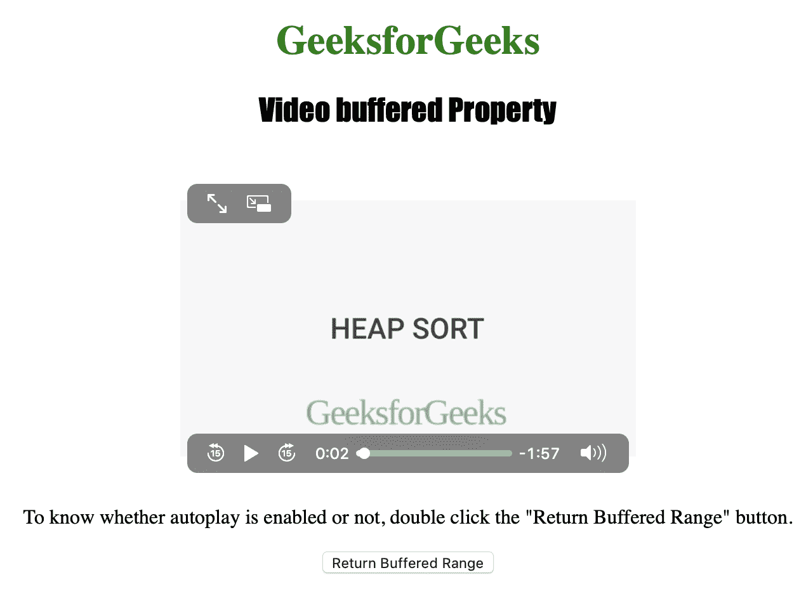

# HTML | DOM 视频缓冲属性

> 原文:[https://www . geesforgeks . org/html-DOM-video-buffered-property/](https://www.geeksforgeeks.org/html-dom-video-buffered-property/)

**视频缓冲属性**用于*返回时间范围对象*。用户缓冲的视频范围可以使用时间范围对象来表示。
缓冲视频的时间范围由缓冲范围定义，如果用户跳过视频，可能会产生多个缓冲范围。

**语法:**

```html
videoObject.buffered
```

下面的程序说明了视频缓冲属性:
**示例-1:** 以秒为单位获取视频的第一个缓冲范围。

```html

<!DOCTYPE html>
<html>

<head>
    <title>
      Video buffered Property in HTML
    </title>
    <style>
        h1 {
            color: green;
        }

        h2 {
            font-family: Impact;
        }

        body {
            text-align: center;
        }
    </style>
</head>

<body>

    <h1>
      GeeksforGeeks
    </h1>
    <h2>
      Video buffered Property
    </h2>
    <br>

    <video id="Test_Video"
           width="360"
           height="240" 
           controls autoplay>

        <source src="samplevideo.mp4"
                type="video/mp4">

        <source src="movie.ogg"
                type="video/ogg">
    </video>

    <p>
      To know whether autoplay is enabled
      or not, double click the
      "Return Buffered Range" button.
    </p>

    <button ondblclick="My_Video()">
      Return Buffered Range
    </button>

    <p id="test"></p>

    <script>
        function My_Video() {
            var v = document.getElementById("Test_Video");

            document.getElementById("test").innerHTML =
              "Start Time : " + v.buffered.start(0) +
              " End Time: " + v.buffered.end(0);
        }
    </script>

</body>

</html>
```

**输出:**

*   点击按钮前:
    
*   点击按钮后:
    

**支持的浏览器:**以下是 *HTML | DOM 视频缓冲属性*支持的浏览器:

*   谷歌 Chrome
*   微软公司出品的 web 浏览器
*   火狐浏览器
*   歌剧
*   苹果 Safari