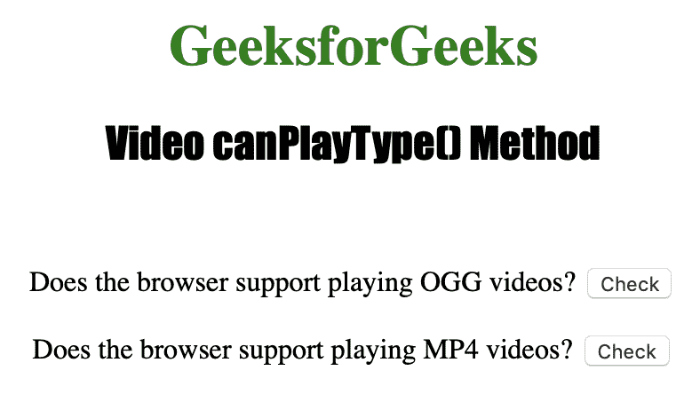

# HTML | DOM 视频 canPlayType()方法

> 原文:[https://www . geesforgeks . org/html-DOM-video-canplaytype-method/](https://www.geeksforgeeks.org/html-dom-video-canplaytype-method/)

**视频播放类型()**方法用于检查*浏览器是否可以播放指定的视频类型*。方法返回一个代表支持级别的字符串。

**语法:**

```html
videoObject.canPlayType(type)
```

**参数值:**

*   **类型:**指定测试支持的视频类型(和可选编解码器)。

**返回:**Video canPlayType()方法通常返回以下值之一:

*   **“可能”:**表示浏览器最有可能支持这种视频类型。
*   **“可能”:**表示浏览器可能支持这种视频类型。
*   **" "(空字符串):**表示浏览器不支持这种视频类型。

下面的程序说明了 Video canPlayType()方法:

**示例:**检查浏览器是否可以播放不同类型的视频。

```html
<!DOCTYPE html>
<html>

<head>
    <title>
        DOM Video canPlayType( ) Method
    </title>
</head>

<body style="text-align: center">

    <h1 style="color: green">
      GeeksforGeeks
  </h1>
    <h2 style="font-family: Impact">
      Video canPlayType() Method
  </h2>
    <br>

    <p>
      Does the browser support playing OGG videos? <span>
<button ondblclick=
        "My_Video(event, 'video/ogg', 'theora, vorbis')"
        type="button">Check</button>
</span></p>

    <p>Does the browser support playing MP4 videos? <span>
<button ondblclick=
        "My_Video(event, 'video/mp4', 'avc1.42E01E, mp4a.40.2')"
         type="button">Check</button>
</span></p>

    <script>
        function My_Video(e, vidType, codType) {

            var v = document.createElement("Video");
            isSupp = 
              v.canPlayType(vidType + ';codecs="' 
                            + codType + '"');

            if (isSupp == "") {
                isSupp = "No";
            }

            e.target.parentNode.innerHTML = 
              "Compatilibility : " + isSupp;

        }
    </script>

</body>

</html>
```

**输出:**

*   点击按钮前:
    
*   点击按钮后:
    

**支持的浏览器:**以下是 *HTML | DOM Video canPlayType()方法*支持的浏览器:

*   谷歌 Chrome
*   Internet Explorer 9.0
*   火狐浏览器
*   歌剧
*   苹果 Safari