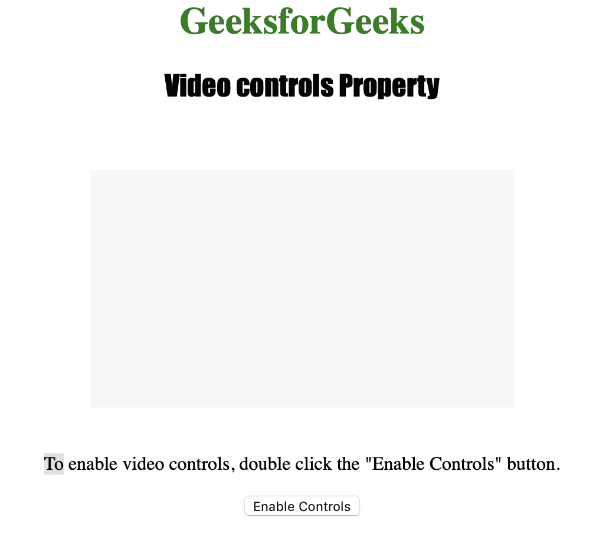

# HTML | DOM 视频控件属性

> 原文:[https://www . geesforgeks . org/html-DOM-video-controls-property/](https://www.geeksforgeeks.org/html-dom-video-controls-property/)

**视频控件属性**用于**设置**或**返回**视频是否显示标准视频控件。
**<视频>** 控件属性通过该属性体现。

属性中包含的视频控件有:

*   玩
*   中止
*   卷
*   全屏模式
*   寻找
*   字幕/字幕
*   轨道

**语法:**

*   返回控件属性:

    ```html
    videoObject.controls
    ```

*   设置控件属性:

    ```html
    videoObject.controls = true|false
    ```

**属性值:**

*   **true|false:** 用于指定视频是否应该显示控件。

**返回值:**返回值为布尔值，如果显示视频控件则返回 true，否则返回 false。

下面的程序说明了视频控件属性:
**示例:**启用视频控件。

```html
<!DOCTYPE html>
<html>

<head>
    <title>
      Video controls Property in HTML
    </title>
    <style>
        h1 {
            color: green;
        }

        h2 {
            font-family: Impact;
        }

        body {
            text-align: center;
        }
    </style>
</head>

<body>

    <h1>GeeksforGeeks</h1>
    <h2>Video controls Property</h2>
    <br>

    <video id="Test_Video" 
           width="360"
           height="240">

        <source src="samplevideo.mp4"
                type="video/mp4">

        <source src="movie.ogg" 
                type="video/ogg">
    </video>

    <p>To enable video controls, double
      click the "Enable Controls" button.</p>

    <button ondblclick="My_Video()"
            type="button">
      Enable Controls
    </button>

    <p id="test"></p>

    <script>
        function My_Video() {
            document.getElementById(
              "Test_Video").controls = true;
        }
    </script>

</body>

</html>
```

**输出:**

*   点击按钮前:
    
*   点击按钮后:
    

**支持的浏览器:***HTML | DOM 视频控件属性*支持的浏览器如下:

*   谷歌 Chrome
*   微软公司出品的 web 浏览器
*   火狐浏览器
*   歌剧
*   苹果 Safari