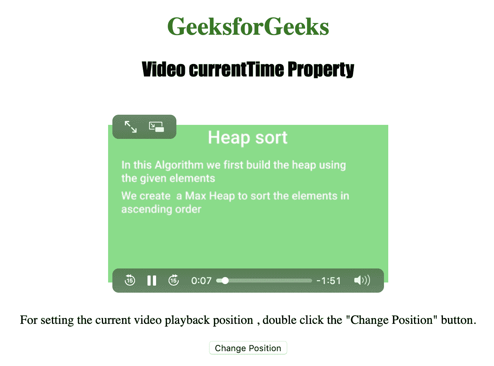
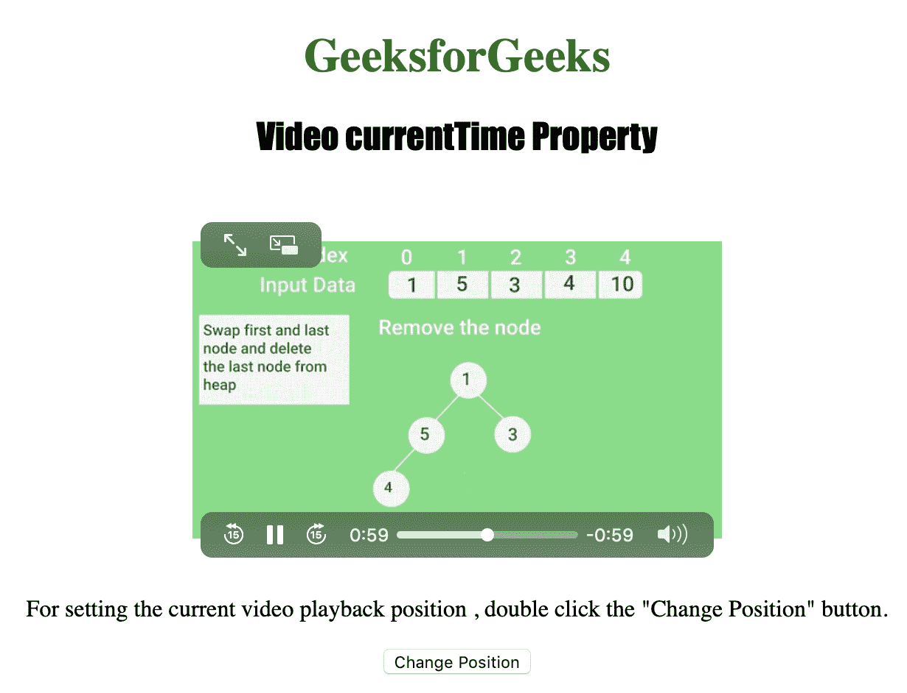

# HTML | DOM 视频流时间属性

> 原文:[https://www . geesforgeks . org/html-DOM-video-current time-property/](https://www.geeksforgeeks.org/html-dom-video-currenttime-property/)

**视频当前时间属性**用于**设置**或**返回** *视频播放的当前位置*。Video currentTime 属性以秒的形式返回视频播放位置。
设置该属性时，播放跳转到指定位置。

**语法:**

*   返回当前时间属性:

    ```html
     videoObject.currentTime
    ```

*   设置当前时间属性:

    ```html
     videoObject.currentTime = seconds
    ```

**属性值:**

*   **秒:**用于以秒为单位指定视频播放的位置。

下面的程序说明了视频电流时间属性:
**示例:**将时间位置设置为 50 秒。

```html
<!DOCTYPE html>
<html>

<head>
    <title>
        HTML | DOM Video currentTime Property
    </title>   
    <style>
        h1 {
            color: green;
        }

        h2 {
            font-family: Impact;
        }

        body {
            text-align: center;
        }
    </style>
</head>

<body>

    <h1>GeeksforGeeks</h1>
    <h2>
      Video currentTime Property
    </h2>
    <br>

    <video id="Test_Video" 
           width="360" 
           height="240" 
           controls>
        <source src="samplevideo.mp4"
                type="video/mp4">
        <source src="movie.ogg"
                type="video/ogg">
    </video>

    <p>
      For setting the current video playback position,
      double click the "Change Position" button.
    </p>

    <button ondblclick="My_Video()"
            type="button">
      Change Position
    </button>

    <script>
        var v = document.getElementById("Test_Video");

        function My_Video() {
            v.currentTime = 50;
        }
    </script>

</body>

</html>
```

**输出:**

*   点击按钮前:
    
*   点击按钮后:
    

**支持的浏览器:**以下是 *HTML | DOM Video currentTime 属性*支持的浏览器:

*   谷歌 Chrome
*   微软公司出品的 web 浏览器
*   火狐浏览器
*   歌剧
*   苹果 Safari