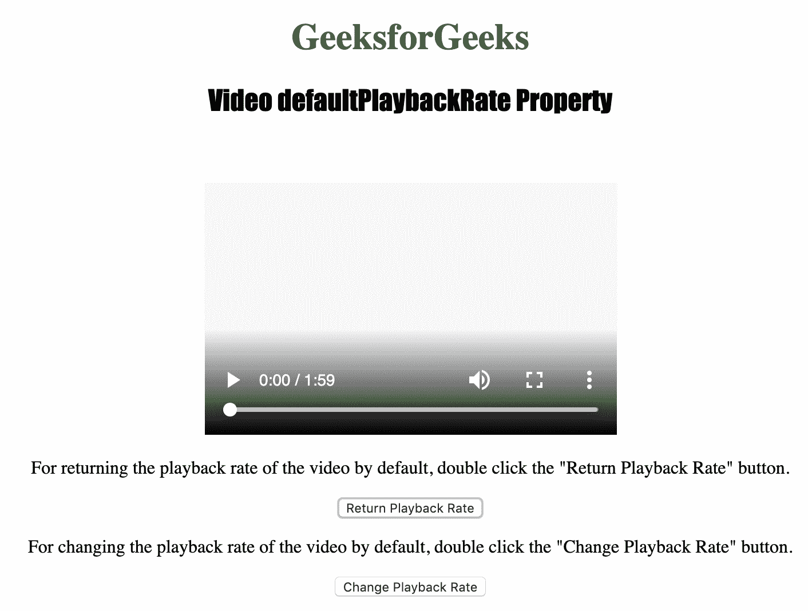
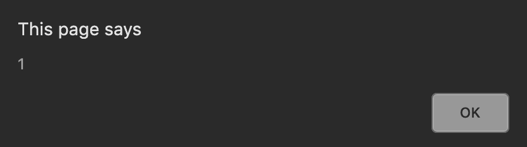

# HTML | DOM 视频默认播放速率属性

> 原文:[https://www . geesforgeks . org/html-DOM-video-defaultplaybackrate-property/](https://www.geeksforgeeks.org/html-dom-video-defaultplaybackrate-property/)

**视频默认播放回放速度属性**用于**设置**或**返回** *视频的默认播放速度*。
视频 **defaultPlaybackRate** 属性只改变默认播放速度，不改变当前播放速度。

**语法:**

*   返回默认播放回放速率属性:

    ```html
    videoObject.defaultPlaybackRate
    ```

*   设置默认播放回放速率属性:

    ```html
    videoObject.defaultPlaybackRate = number
    ```

**属性值:**

**number:** 

*   1.0 是正常速度。*   0.5 是半速。*   2.0 是双倍速度。*   -1.0 是倒退，正常速度。*   -0.5 is backwards, half speed.

    下面的程序说明了视频默认播放回放速度属性:
    **示例:**默认将视频设置为双倍速度。

    ```html
    <!DOCTYPE html>
    <html>

    <head>
        <title>
            HTML | DOM Video defaultPlaybackRate Property
        </title>
        <style>
            h1 {
                color: green;
            }

            h2 {
                font-family: Impact;
            }

            body {
                text-align: center;
            }
        </style>
    </head>

    <body>

        <h1>GeeksforGeeks</h1>
        <h2>
          Video defaultPlaybackRate Property
        </h2>
        <br>

        <video id="Test_Video"
               width="360" 
               height="240"
               controls>
            <source src="samplevideo.mp4" 
                    type="video/mp4">

            <source src="movie.ogg"
                    type="video/ogg">
        </video>

        <p>
          For returning the playback rate of the 
          video by default, double click the 
          "Return Playback Rate" button.
        </p>
        <button ondblclick="My_VideoRate()" 
                type="button">
          Return Playback Rate
        </button>

        <p>
          For changing the playback rate of the
          video by default, double click the 
          "Change Playback Rate" button.
        </p>
        <button ondblclick="Set_VideoRate()"
                type="button">
          Change Playback Rate
        </button>

        <script>
            var v = 
                document.getElementById(
                  "Test_Video");

            function My_VideoRate() {
                alert(v.defaultPlaybackRate);
            }

            function Set_VideoRate() {
                v.defaultPlaybackRate = 2;
                v.load();
            }
        </script>

    </body>

    </html>
    ```

    **输出:**
    

    **初始播放速率**
    

    **更新播放速率**
    

    **支持的浏览器:**支持的浏览器*HTML | DOM Video defaultPlaybackRate 属性*如下:

    *   谷歌 Chrome
    *   微软公司出品的 web 浏览器
    *   火狐浏览器
    *   歌剧
    *   苹果 Safari