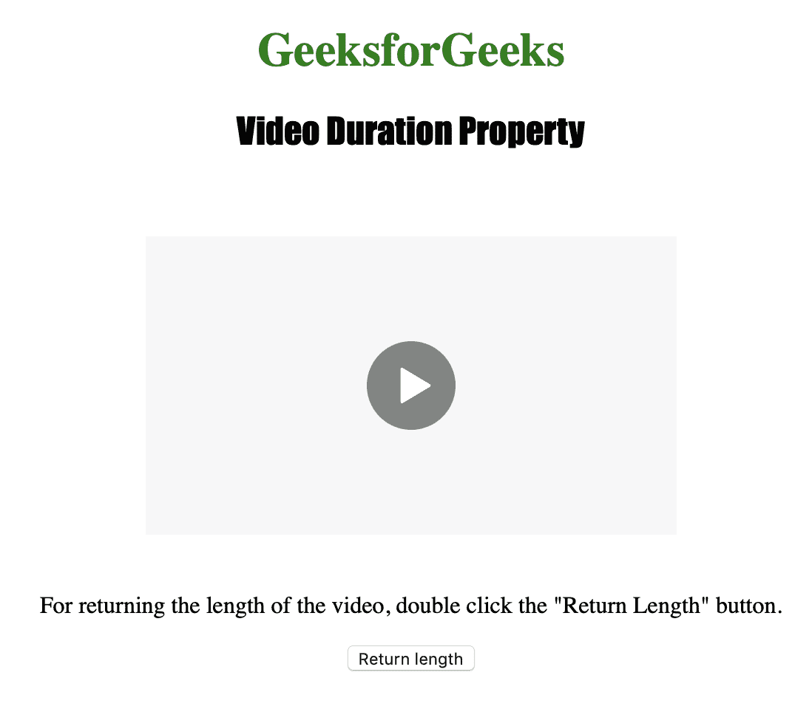
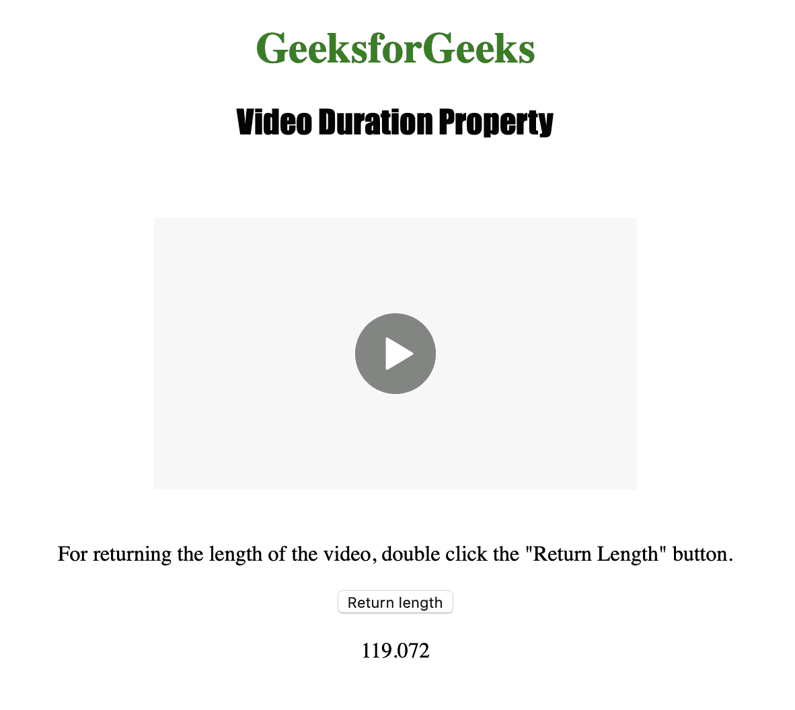

# HTML | DOM 视频时长属性

> 原文:[https://www . geesforgeks . org/html-DOM-video-duration-property/](https://www.geeksforgeeks.org/html-dom-video-duration-property/)

**视频时长属性**用于**返回** *视频的长度*。视频持续时间属性返回以秒为单位的值。不同的浏览器返回不同的精度值，例如 safari 最多返回 14 个小数位，opera 最多返回 9 个小数位。
视频持续时间属性是只读属性。
如果没有设置视频，视频时长功能返回**“NaN”**，而如果视频是流式的，没有预定义的长度，则返回**“Inf”**(无穷大)。

**语法:**

```html
videoObject.duration
```

下面的程序说明了视频持续时间属性:
**示例:**获取视频的长度。

```html
<!DOCTYPE html>
<html>

<head>
    <title>
        HTML | DOM Video duration Property
    </title>
    <style>
        h1 {
            color: green;
        }

        h2 {
            font-family: Impact;
        }

        body {
            text-align: center;
        }
    </style>
</head>

<body>

    <h1>GeeksforGeeks</h1>
    <h2>Video Duration Property</h2>
    <br>

    <video id="Test_Video" 
           width="360" 
           height="240" 
           controls>
        <source src="samplevideo.mp4"
                type="video/mp4">
        <source src="movie.ogg" 
                type="video/ogg">
    </video>

    <p>For returning the length of the video,
      double click the "Return Length" button.
    </p>
    <button ondblclick="My_Video()"
            type="button">
      Return length
    </button>

    <p id="test"></p>

    <script>
        function My_Video() {
            var v = 
                document.getElementById(
                  "Test_Video").duration;

            document.getElementById(
              "test").innerHTML = v;
        }
    </script>

</body>

</html>
```

**输出:**

*   点击按钮前:
    
*   点击按钮后:
    

**支持的浏览器:**下面列出了 *HTML | DOM 视频时长属性*支持的浏览器:

*   谷歌 Chrome
*   微软公司出品的 web 浏览器
*   火狐浏览器
*   歌剧
*   苹果 Safari