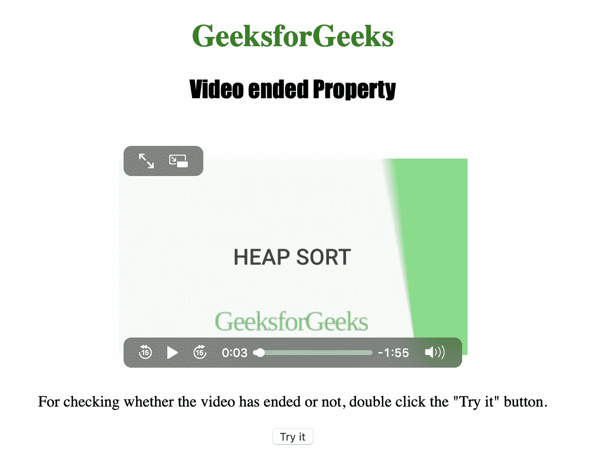
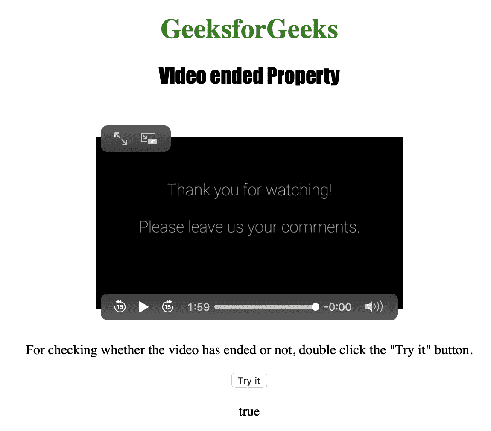

# HTML | DOM 视频结束属性

> 原文:[https://www . geesforgeks . org/html-DOM-video-end-property/](https://www.geeksforgeeks.org/html-dom-video-ended-property/)

HTML DOM 中的**视频结束属性**用于*返回视频播放是否已经结束*。
当播放位置在视频末尾时，我们认为视频已经结束。
视频结束属性为只读属性。

**返回值:**如果视频已经结束，则 Video ended 属性返回布尔值 true，否则返回 false。

**语法:**

```html
videoObject.ended
```

下面的程序说明了视频结束属性:
**示例:**找出视频是否已经结束。

```html
<!DOCTYPE html>
<html>

<head>
    <title>  
        HTML | DOM Video ended Property
    </title>
    <style>
        h1 {
            color: green;
        }

        h2 {
            font-family: Impact;
        }

        body {
            text-align: center;
        }
    </style>
</head>

<body>

    <h1>GeeksforGeeks</h1>
    <h2>Video ended Property</h2>
    <br>

    <video id="Test_Video" 
           width="360"
           height="240"
           controls>
        <source src="samplevideo.mp4" 
                type="video/mp4">
        <source src="movie.ogg" 
                type="video/ogg">
    </video>

    <p>
      For checking whether the video has
      ended or not, double click the 
      "Try it" button.
    </p>

    <button ondblclick="My_Video()"
            type="button">
      Try it
    </button>

    <p id="test"></p>

    <script>
        function My_Video() {
            var v = 
                document.getElementById(
                  "Test_Video").ended;

            document.getElementById(
              "test").innerHTML = v;
        }
    </script>

</body>

</html>
```

**输出:**

*   点击按钮前:
    
*   点击按钮后:
    

**支持的浏览器:**以下是 *HTML | DOM 视频端属性*支持的浏览器:

*   谷歌 Chrome
*   微软公司出品的 web 浏览器
*   火狐浏览器
*   歌剧
*   苹果 Safari