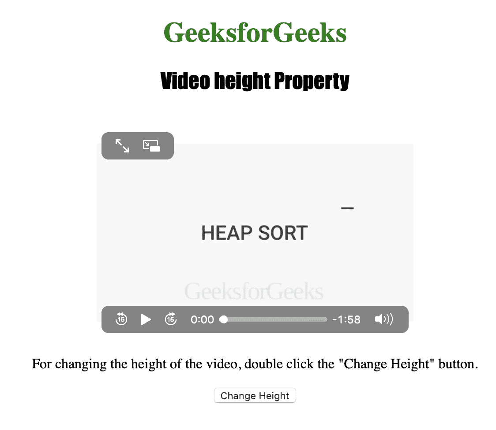
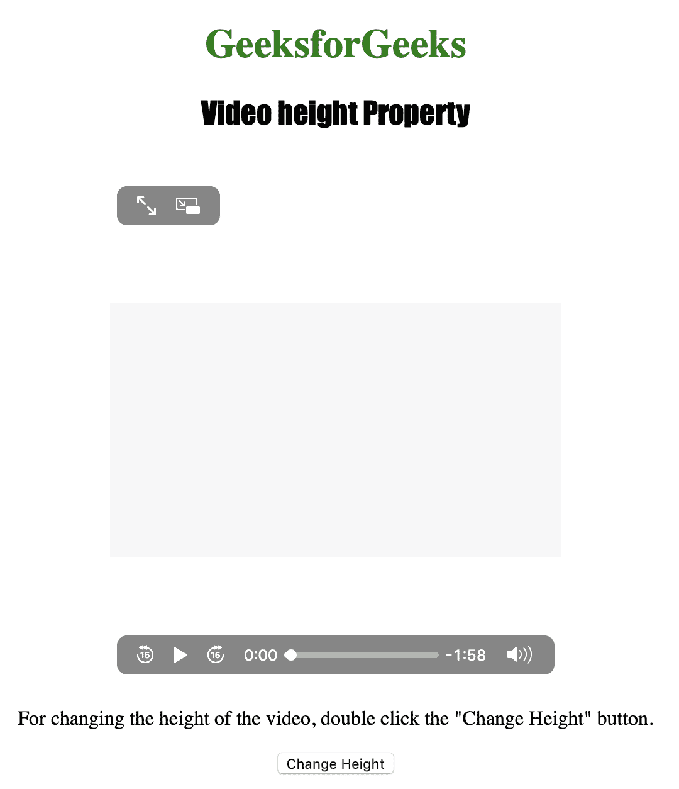

# HTML | DOM 视频高度属性

> 原文:[https://www . geesforgeks . org/html-DOM-video-height-property/](https://www.geeksforgeeks.org/html-dom-video-height-property/)

**视频高度属性**用于**设置**或**返回** *视频的高度属性*的值。
视频高度属性返回视频的高度，以像素为单位。

**语法:**

*   **返回高度属性:**

    ```html
    videoObject.height
    ```

*   **设置高度属性:**

    ```html
    videoObject.height = pixels
    ```

**属性值:**

**pixels :**

下面的程序说明了视频高度属性:
**示例:**更改视频的高度。

```html
<!DOCTYPE html>
<html>

<head>
    <style>
        h1 {
            color: green;
        }

        h2 {
            font-family: Impact;
        }

        body {
            text-align: center;
        }
    </style>
</head>

<body>

    <h1>GeeksforGeeks</h1>
    <h2>Video height Property</h2>
    <br>

    <video id="Test_Video" 
           width="360" 
           height="240"
           controls>
        <source src="samplevideo.mp4"
                type="video/mp4">
        <source src="movie.ogg" 
                type="video/ogg">
    </video>

    <p>
      For changing the height of the video,
      double click the "Change Height" button.
  </p>

    <button ondblclick="My_Video()"
            type="button">
      Change Height
  </button>

    <p id="test"></p>

    <script>
        function My_Video() {
            document.getElementById(
              "Test_Video").height = "400";
        }
    </script>

</body>

</html>
```

**输出:**
**点击按钮前:**


**点击按钮后:**


**支持的浏览器:**

*   苹果 Safari
*   微软公司出品的 web 浏览器
*   火狐浏览器
*   谷歌 Chrome
*   歌剧