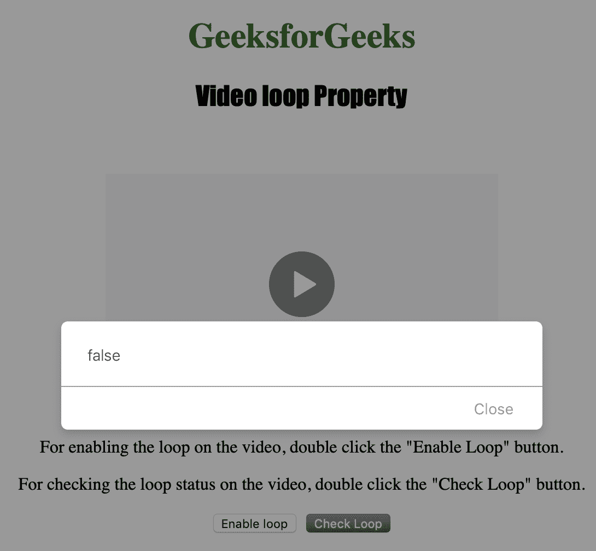
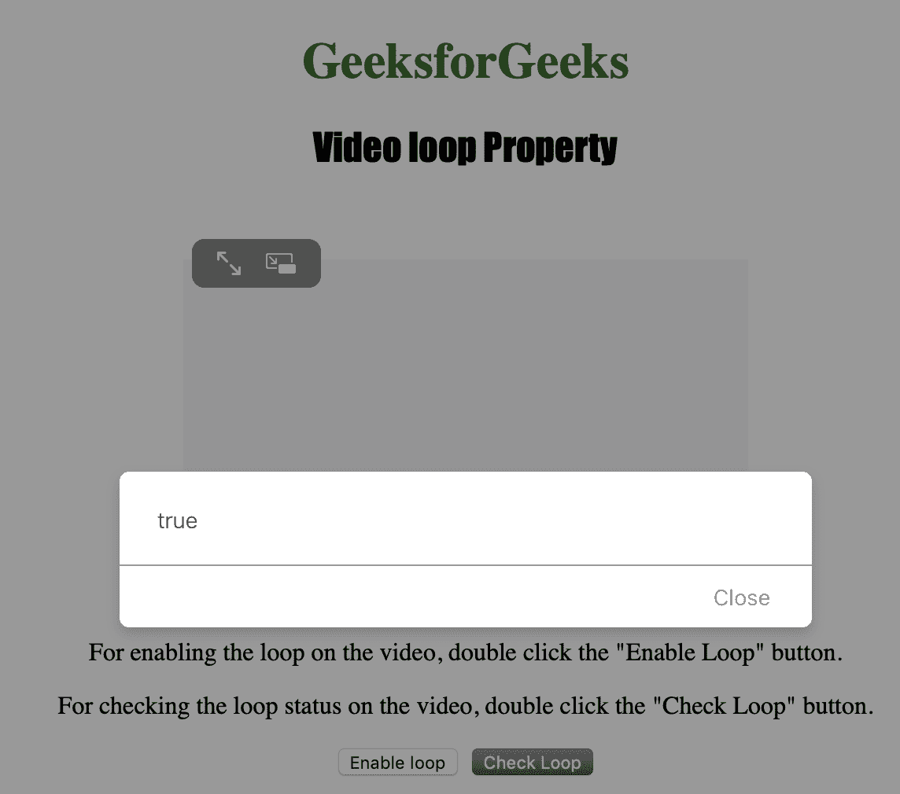

# HTML | DOM 视频循环属性

> 原文:[https://www.geeksforgeeks.org/html-dom-video-loop-property/](https://www.geeksforgeeks.org/html-dom-video-loop-property/)

**视频循环属性**用于**设置**或**返回**一个视频结束后是否*重新开始播放*。

**语法:**

*   返回循环属性:

    ```html
    videoObject.loop
    ```

*   设置循环属性:

    ```html
    videoObject.loop = true|false
    ```

**属性值:**

*   **true | false:** 用于指定视频是否应该重新开始播放，每次播放完还是不播放。

**Return:** 如果视频再次开始播放，则 Video loop 属性返回 Boolean true，每次播放完毕，否则返回 false。

下面的程序说明了视频循环属性:

**示例:**将视频设置为循环。

```html
<!DOCTYPE html>
<html>

<head>
    <title>
        HTML | DOM Video loop Property
    </title>
    <style>
        h1 {
            color: green;
        }

        h2 {
            font-family: Impact;
        }

        body {
            text-align: center;
        }
    </style>
</head>

<body>

    <h1>GeeksforGeeks</h1>
    <h2>Video loop Property</h2>
    <br>

    <video id="Test_Video" 
           width="360"
           height="240"
           controls>

        <source src="samplevideo.mp4" 
                type="video/mp4">
        <source src="movie.ogg" 
                type="video/ogg">
    </video>

    <p>
      For enabling the loop on the video, 
      double click the "Enable Loop" button.
    </p>
    <p>
      For checking the loop status on the video,
      double click the "Check Loop" button.
    </p>

    <button ondblclick="Enable_Loop()" 
            type="button">
      Enable loop
    </button>
    <button ondblclick="Check_Loop()"
            type="button">
      Check Loop
  </button>

    <p id="test"></p>

    <script>
        var v = document.getElementById(
          "Test_Video");

        function Enable_Loop() {
            v.loop = true;
            v.load();
        }

        function Check_Loop() {
            alert(v.loop);
        }
    </script>

</body>

</html>
```

**输出:**

*   最初:
    
*   点击“启用循环”按钮前:
    
*   点击启用循环按钮后:
    

**支持的浏览器:**下面列出了 *HTML | DOM 视频循环属性*支持的浏览器:

*   谷歌 Chrome
*   微软公司出品的 web 浏览器
*   火狐浏览器
*   歌剧
*   苹果 Safari