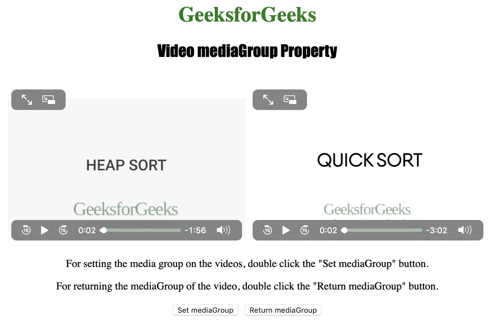
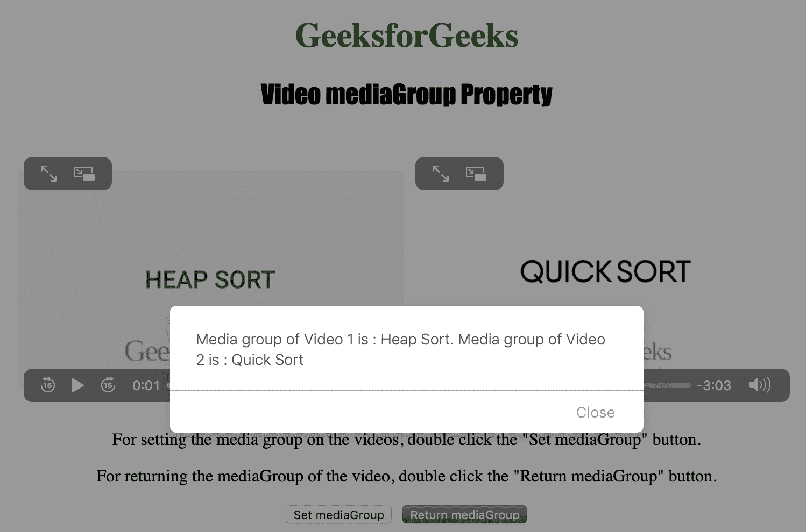

# HTML | DOM 视频媒体群属性

> 原文:[https://www . geesforgeks . org/html-DOM-video-media group-property/](https://www.geeksforgeeks.org/html-dom-video-mediagroup-property/)

**视频媒体组属性**用于**设置**或**返回** *视频所属媒体组的名称。
两个或更多 **<视频>** 元素可以使用一个媒体组同步在一起。
视频**媒体组**属性返回一个代表视频媒体组的字符串。*

**语法:**

*   返回 mediaGroup 属性:

    ```html
    videoObject.mediaGroup
    ```

*   设置媒体组属性:

    ```html
    videoObject.mediaGroup = group
    ```

**属性值:**

*   **组:**用于指定视频的媒体组。

下面的程序说明了视频媒体组属性:
**示例:**将视频设置为循环。

```html
<!DOCTYPE html>
<html>

<head>
    <title>
        HTML | DOM Video mediaGroup Property
    </title>
    <style>
        h1 {
            color: green;
        }

        h2 {
            font-family: Impact;
        }

        body {
            text-align: center;
        }
    </style>
</head>

<body>

    <h1>GeeksforGeeks</h1>
    <h2>Video mediaGroup Property</h2>
    <br>

    <video id="Test_Video1" 
           width="360" 
           height="240" 
           controls>
        <source src="samplevideo.mp4" 
                type="video/mp4">
        <source src="movie.ogg" 
                type="video/ogg">
    </video>

    <video id="Test_Video2"
           width="360"
           height="240" 
           controls>
        <source src="sample2.mp4"
                type="video/mp4">
        <source src="movie.ogg" 
                type="video/ogg">
    </video>

    <p>
      For setting the media group on the videos,
      double click the "Set mediaGroup" button.
    </p>
    <p>
      For returning the mediaGroup of the video,
      double click the "Return mediaGroup" button.
    </p>

    <button ondblclick="set()" 
            type="button">
      Set mediaGroup
    </button>
    <button ondblclick="get()"
            type="button">
      Return mediaGroup
    </button>

    <script>
        var v1 = document.getElementById(
          "Test_Video1");
        var v2 = document.getElementById(
          "Test_Video2");

        function set() {
            v1.mediaGroup = "Heap Sort";
            v2.mediaGroup = "Quick Sort";
        }

        function get() {
            alert("Media group of Video 1 is : "
                  + v1.mediaGroup +
                ". Media group of Video 2 is : "
                  + v2.mediaGroup);
        }
    </script>

</body>

</html>
```

**输出:**

*   点击设置媒体组按钮前:
    
*   点击【设置媒体组】按钮后:
    

**支持的浏览器:**以下是 *HTML | DOM 视频媒体集团属性*支持的浏览器:

*   谷歌 Chrome
*   微软公司出品的 web 浏览器
*   火狐浏览器
*   歌剧
*   苹果 Safari