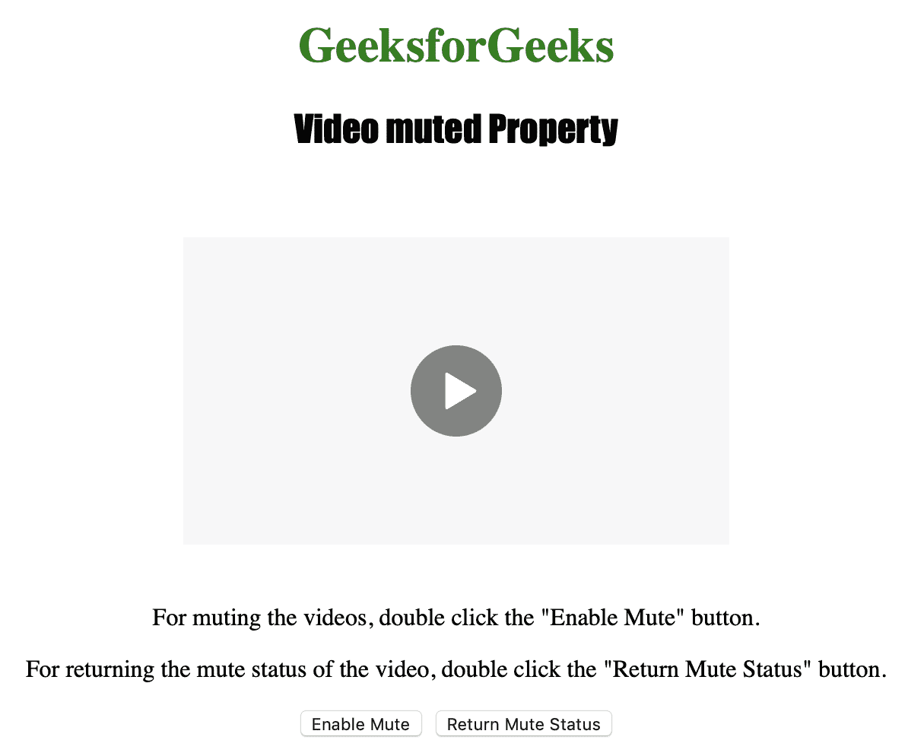
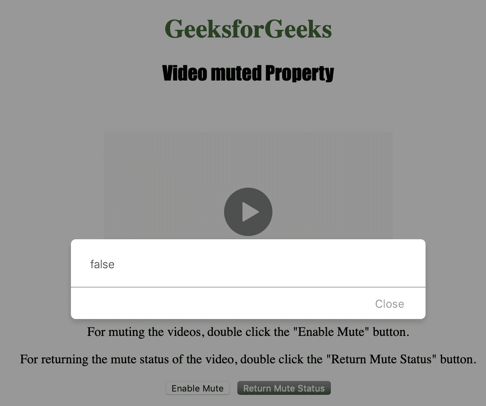
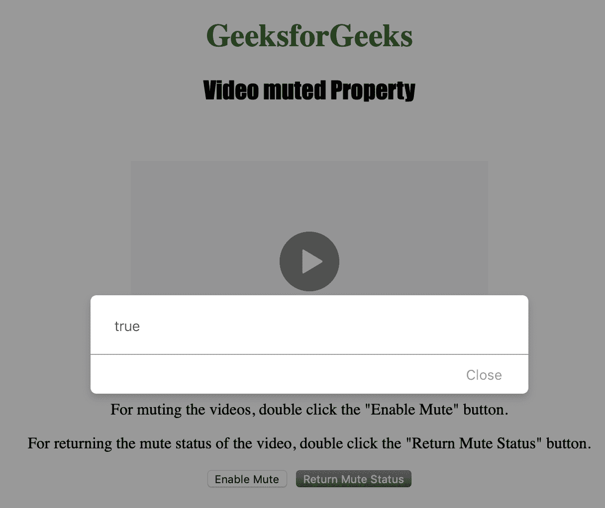

# HTML | DOM 视频静音属性

> 原文:[https://www . geesforgeks . org/html-DOM-video-muted-property/](https://www.geeksforgeeks.org/html-dom-video-muted-property/)

**视频静音属性**用于**设置**或**返回**视频的音频输出是否应该静音*。*

***语法:***

*   *用于返回静音属性:

    ```html
    videoObject.muted
    ```* 
*   *用于设置静音属性:

    ```html
    videoObject.muted = true|false
    ```* 

***属性值:***

*   ***true|false:** 用于指定视频的音频输出是否要静音。*

***返回:**如果视频的音频输出为静音，则视频静音属性返回布尔值 true，否则返回 false。*

*下面的程序说明了视频静音属性:*

***示例:**关闭视频的声音。*

```html
*<!DOCTYPE html>
<html>

<head>
    <title>
        HTML | DOM Video muted Property
    </title>
    <style>
        h1 {
            color: green;
        }

        h2 {
            font-family: Impact;
        }

        body {
            text-align: center;
        }
    </style>
</head>

<body>

    <h1>GeeksforGeeks</h1>
    <h2>Video muted Property</h2>
    <br>

    <video id="Test_Video" 
           width="360" 
           height="240"
           controls>
        <source src="samplevideo.mp4" 
                type="video/mp4">
        <source src="movie.ogg" 
                type="video/ogg">
    </video>

    <p>
      For muting the videos, double
      click the "Enable Mute" button.
    </p>
    <p>
      For returning the mute status of the
      video, double click the "Return Mute
      Status" button.
    </p>

    <button ondblclick="set()" 
            type="button">
      Enable Mute
    </button>
    <button ondblclick="get()"
            type="button">
      Return Mute Status
    </button>

    <script>
        var v = document.getElementById(
          "Test_Video");

        function set() {
            v.muted = true;
        }

        function get() {
            alert(v.muted);
        }
    </script>

</body>

</html>*
```

***输出:***

*   *最初:
    **   *启用静音前:
    **   *After enabling mute:
    

    **支持的浏览器:**以下是 *HTML | DOM 视频静音属性*支持的浏览器:

    *   谷歌 Chrome
    *   微软公司出品的 web 浏览器
    *   火狐浏览器
    *   歌剧
    *   苹果 Safari*