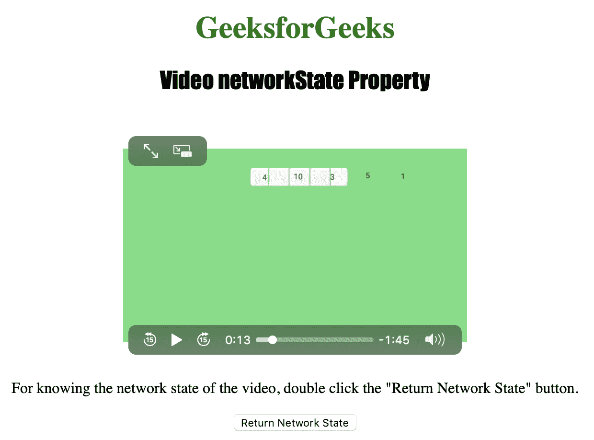
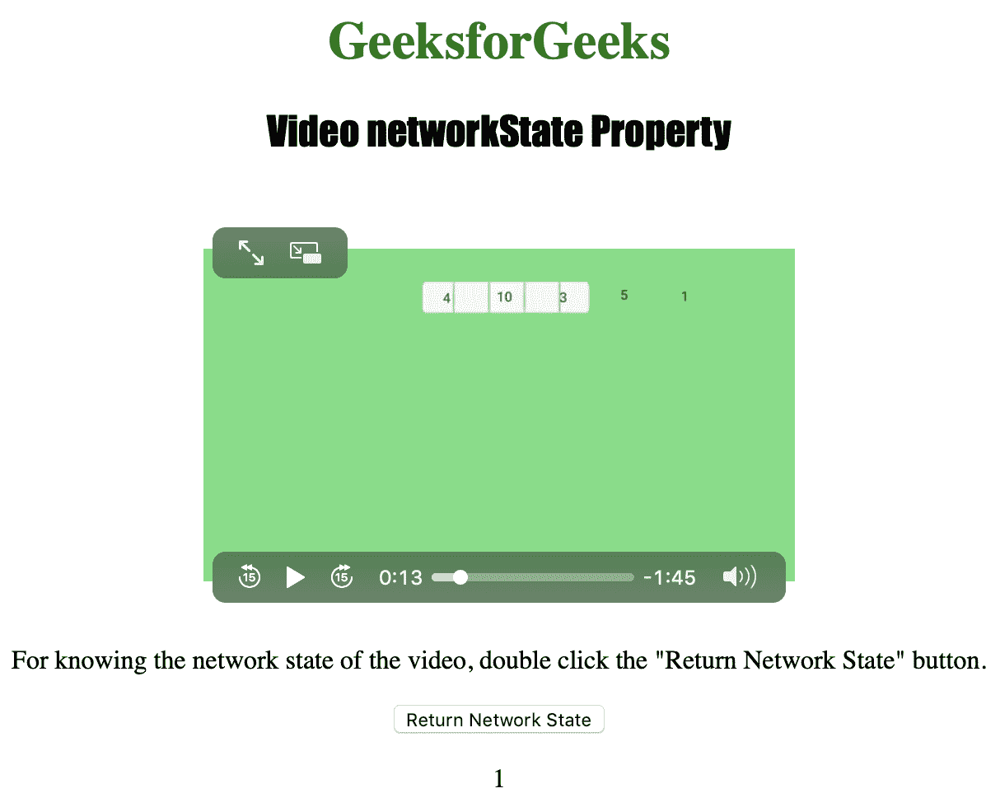

# HTML | DOM 视频网络状态属性

> 原文:[https://www . geesforgeks . org/html-DOM-video-network state-property/](https://www.geeksforgeeks.org/html-dom-video-networkstate-property/)

**视频网络状态属性**用于**返回** *视频的当前网络状态*。
视频网络状态返回一个可能具有以下值的数字:

*   **0 = NETWORK_EMPTY:** 表示视频尚未初始化。
*   **1 = NETWORK_IDLE:** 表示视频处于活动状态，并已选择资源，但未使用网络
*   **2 = NETWORK_LOADING:** 表示浏览器正在下载数据。
*   **3 = NETWORK_NO_SOURCE:** 表示没有找到视频源

**语法:**

```html
 videoObject.networkState
```

下面的程序说明了视频网络状态属性:
**示例:**获取视频的当前网络状态。

```html
<!DOCTYPE html>
<html>

<head>
    <title>
       HTML | DOM Video networkState Property
    </title>
</head>
<body style="text-align:center">

    <h1 style="color:green">
      GeeksforGeeks
    </h1>
    <h2 style="font-family:Impact">
      Video networkState Property
    </h2>
    <br>

    <video id="Test_Video"
           width="360"
           height="240"
           controls>
        <source src="samplevideo.mp4" 
                type="video/mp4">
        <source src="movie.ogg" 
                type="video/ogg">
    </video>

    <p>For knowing the network state of
      the video, double click the "Return 
      Network State" button.
    </p>

    <button ondblclick="set()" 
            type="button">
      Return Network State
    </button>

    <p id="test"></p>

    <script>
        function set() {

            var v = document.getElementById(
              "Test_Video").networkState;

            document.getElementById("test").innerHTML = v;
        }
    </script>

</body>

</html>
```

**输出:**

*   点击按钮前:
    
*   After clicking the button:
    

    **支持的浏览器:**T2】HTML | DOM 视频网络支持的浏览器状态属性如下:

    *   谷歌 Chrome
    *   微软公司出品的 web 浏览器
    *   火狐浏览器
    *   歌剧
    *   苹果 Safari