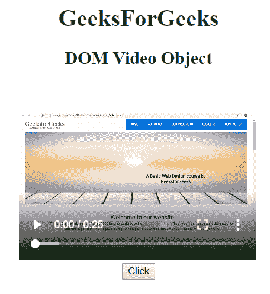
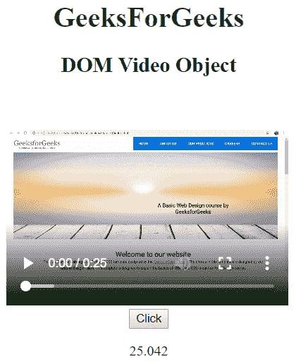
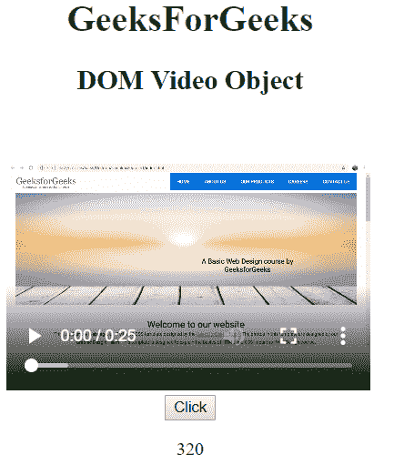

# HTML | DOM 视频对象

> 原文:[https://www.geeksforgeeks.org/html-dom-video-object/](https://www.geeksforgeeks.org/html-dom-video-object/)

HTML DOM 中的**视频对象**代表一个 [**<视频>**](https://www.geeksforgeeks.org/html5-video/) 元素。可以使用 **getElementById()** 方法访问视频元素。

**语法:**

*   To access a video object:

    ```html
     document.getElementById("videoId");
    ```

    其中 id 被分配给<video>标签。</video>

    *   To create a video object:

    ```html
     document.createElement("VIDEO");
    ```

    **属性值:**

    | 价值 | 描述 |
    | 音频轨道 | 它返回一个 AudioTrackList 对象，表示可用的音轨。 |
    | 自动播放 | 它用于设置或返回视频是否应在准备好后立即开始播放。 |
    | 减轻 | 它返回代表视频缓冲部分的时间范围对象。 |
    | 控制器 | 它返回 MediaController 对象，该对象表示视频的当前媒体控制器。 |
    | 控制 | 它用于设置或返回视频是否应该显示播放和暂停控制。 |
    | 交叉原点 | 它设置或返回视频的 CORS 设置。 |
    | 电流 rc | 它返回当前视频的网址。 |
    | 当前时间 | 它设置或返回视频中的当前播放位置。 |
    | 默认静音 | 它设置或返回视频是否默认静音。 |
    | defaultPlaybackRate | 它设置或返回视频的默认播放速度。 |
    | 期间 | 它返回视频的长度。 |
    | 结束 | 用于返回视频播放是否结束。 |
    | 错误 | 它返回一个 MediaError 对象，表示视频的错误状态。 |
    | 高度 | 它用于设置或返回视频的高度属性值。 |
    | 环 | 它用于设置或返回视频是否应该在每次结束时重新播放 |
    | 媒体组/td > |

    它用于设置或返回该视频的媒体组名称。柔和的用于设置或返回是否关闭视频声音。网络状态它返回视频的当前网络状态。暂停它返回视频是否暂停。回放速率它用于设置或返回视频播放速度。演奏它返回一个代表视频播放部分的时间范围对象。海报它用于设置或返回视频海报属性的值。事先装好它用于设置或返回视频的预加载属性值。就绪状态它用于返回视频的当前就绪状态。看起来不错它用于返回代表视频中可查找部分的时间范围对象。寻找它返回用户当前是否在视频中寻找。科学研究委员会它用于设置或返回视频的 src 属性值。开始日期它用于设置或返回视频的 src 属性值。文本轨道它用于返回表示可用文本轨道的文本轨道列表对象。录像带架它用于返回代表可用视频轨道的视频轨道列表对象。卷它用于设置或返回视频的音量。宽度It is used to set or return the value of the width attribute of a video.

    **视频对象方法:**

    *   **暂停:**用于暂停当前正在播放的视频。
    *   **加载:**用于重新加载视频元素。
    *   **播放:**用于开始播放视频。
    *   **添加文本轨道:**用于给视频添加新的文本轨道。
    *   **canPlayType:** 用于检查浏览器是否可以播放指定的视频类型。

    **示例-1:**

    ```html
    <!DOCTYPE html>
    <html>

    <head>
        <title>
            DOM Input Video Object
        </title>
    </head>

    <body>
        <center>
            <h1 style="color:green;"> 
                    GeeksForGeeks 
                </h1>

            <h2>DOM Video Object</h2>

            <video id="gfg"
                   width="320"
                   height="240" 
                   controls>
                <source src=
    "https://media.geeksforgeeks.org/wp-content/uploads/project.mp4" 
                        type="video/mp4">
            </video>

            <br>

            <button type="button" onclick="geeks()">
                Click
            </button>

            <p id="rk"></p>
            <script>
                function geeks() {

                  // get the duration of video 
                  var r =
                  document.getElementById(
                    "gfg").duration;

                  document.getElementById(
                    "rk").innerHTML = r;
                }
            </script>
        </center>
    </body>

    </html>
    ```

    **输出:**

    *   之前点击按钮:
        
    *   点击按钮后:
        

    **示例-2:**

    ```html
    <!DOCTYPE html>
    <html>

    <head>
        <title>
            DOM Input Video Object
        </title>
    </head>

    <body>
        <center>
            <h1 style="color:green;"> 
                    GeeksForGeeks 
                </h1>

            <h2>DOM Video Object</h2>

            <video id="gfg" 
                   width="320" 
                   height="240" 
                   controls>

                <source src=
    "https://media.geeksforgeeks.org/wp-content/uploads/project.mp4" 
                        type="video/mp4">
            </video>

            <br>

            <button type="button" onclick="geeks()">
                Click
            </button>

            <p id="rk"></p>

            <script>
                function geeks() {

                    // Return width
                    var r =
                        document.getElementById(
                          "gfg").width;

                    document.getElementById(
                      "rk").innerHTML = r;
                }
            </script>
        </center>
    </body>

    </html>
    ```

    **输出:**

    *   之前点击按钮:
        
    *   点击按钮后:
        

    **支持的浏览器:***HTML | DOM 视频对象*支持的浏览器如下:

    *   谷歌 Chrome
    *   边缘
    *   Mozilla Firefox
    *   歌剧
    *   旅行队