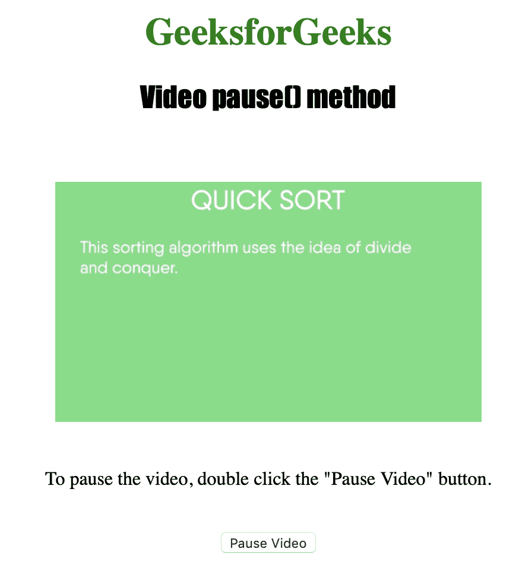
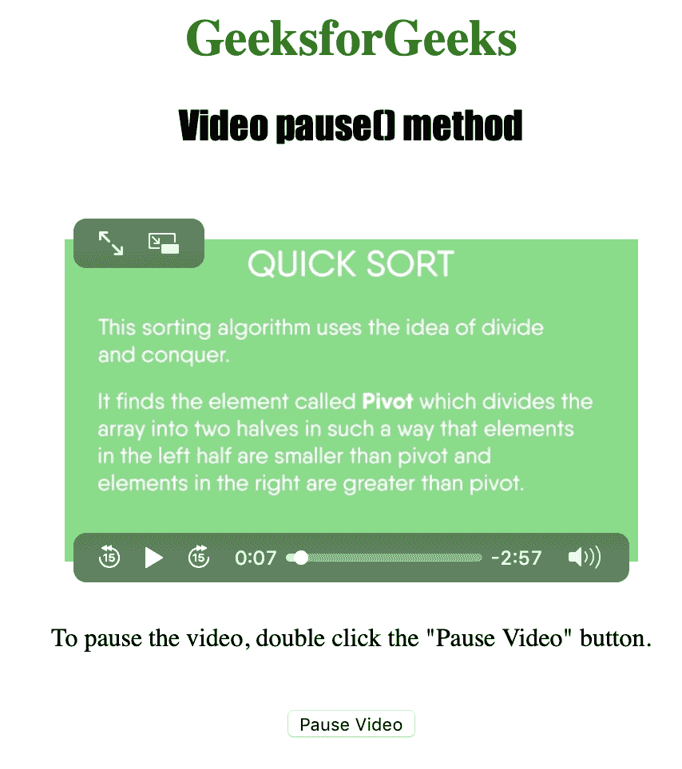

# HTML | DOM 视频暂停( )方法

> 原文:[https://www.geeksforgeeks.org/html-dom-video-pause-method/](https://www.geeksforgeeks.org/html-dom-video-pause-method/)

**视频暂停()**方法用于*暂停当前视频播放*。若要使用 Video pause()方法，必须使用 controls 属性显示视频上附加的视频控件，如播放、暂停、搜索、音量等。

**语法:**

```html
videoObject.pause()
```

**注意:**Video pause()方法不接受任何参数，也不返回值。

下面的程序说明了视频暂停()方法:

**示例:**用暂停按钮暂停视频。

```html
<!DOCTYPE html>
<html>

<head>
    <style>
        h1 {
            color: green;
        }

        h2 {
            font-family: Impact;
        }

        body {
            text-align: center;
        }
    </style>
</head>

<body>

    <h1>GeeksforGeeks</h1>
    <h2>Video pause() method</h2>
    <br>

    <video id="Test_Video" 
           width="360"
           height="240" 
           controls>

        <source id="mp4_source" 
                src="sample2.mp4" 
                type="video/mp4">

        <source id="ogg_source"
                src="sample2.ogg"
                type="video/ogg">
    </video>

    <p>To pause the video, 
      double click the "Pause Video" button.</p>
    <br>

    <button ondblclick="My_Video()" 
            type="button">
      Pause Video
    </button>

    <script>
        var v = 
            document.getElementById(
              "Test_Video");

        function My_Video() {
            v.pause();
        }
    </script>

</body>

</html>
```

**输出:**

*   点击按钮前:
    
*   点击按钮后:
    

**支持的浏览器:**以下是 *HTML | DOM 视频暂停( )方法*支持的浏览器:

*   谷歌 Chrome
*   微软公司出品的 web 浏览器
*   火狐浏览器
*   歌剧
*   苹果 Safari