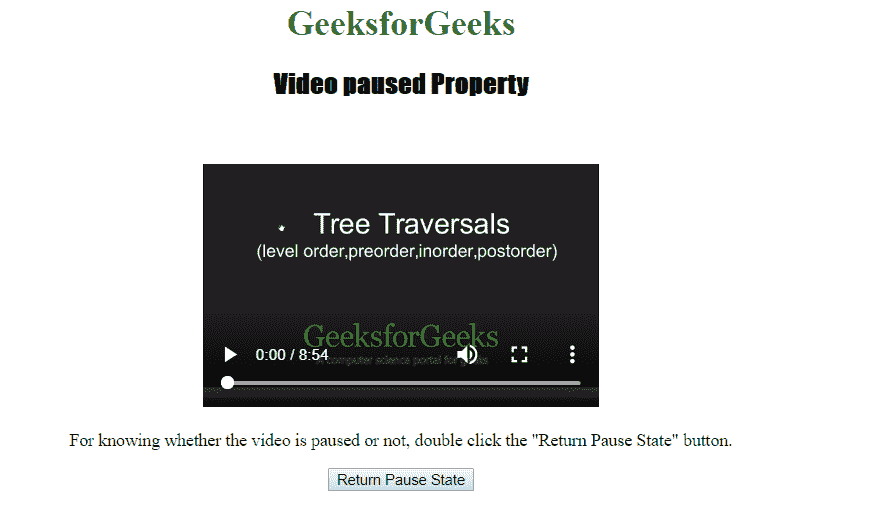
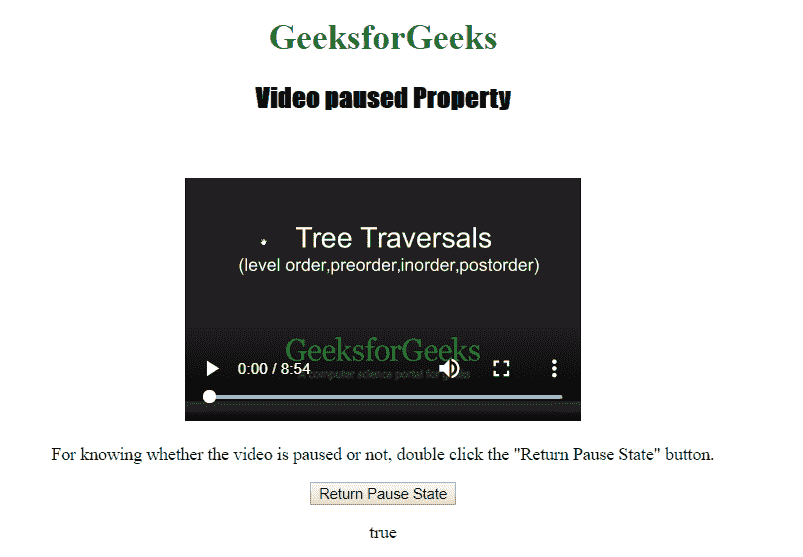

# HTML | DOM 视频暂停属性

> 原文:[https://www . geesforgeks . org/html-DOM-video-已暂停-property/](https://www.geeksforgeeks.org/html-dom-video-paused-property/)

HTML DOM 中的**视频暂停属性**用于返回视频是否暂停。它是只读属性。

**语法:**

```html
videoObject.paused
```

**返回:**如果视频暂停，视频暂停属性返回布尔值 true，否则返回 false。
下面的程序说明了 HTML DOM 中的视频暂停属性:

**示例:**

```html
<!DOCTYPE html>
<html>

<head>     
    <title>
        Video paused Property
    </title>
</head>

<body style="text-align:center;">

    <h1 style="color:green;">
        GeeksforGeeks
    </h1> 

    <h2 style="font-family: Impact;">
        Video paused Property
    </h2><br>

    <video id="Test_Video" width="360" height="240" controls>
        <source src="samplevideo.mp4" type="video/mp4">
        <source src="movie.ogg" type="video/ogg">
    </video>

    <p>
        For knowing whether the video is paused or not,
        double click the "Return Pause State" button.
    </p>

    <button ondblclick="set()" type="button">
        Return Pause State
    </button>

    <p id="test"></p>

    <script>
        function set() {
            var v = document.getElementById("Test_Video").paused;
            document.getElementById("test").innerHTML = v;
        } 
    </script>
</body>

</html>                                                         
```

**输出:**

*   点击按钮前:
    
*   点击按钮后:
    

**支持的浏览器:***视频暂停属性*支持的浏览器如下:

*   谷歌 Chrome
*   Internet Explorer 9.0
*   火狐浏览器
*   歌剧
*   苹果 Safari