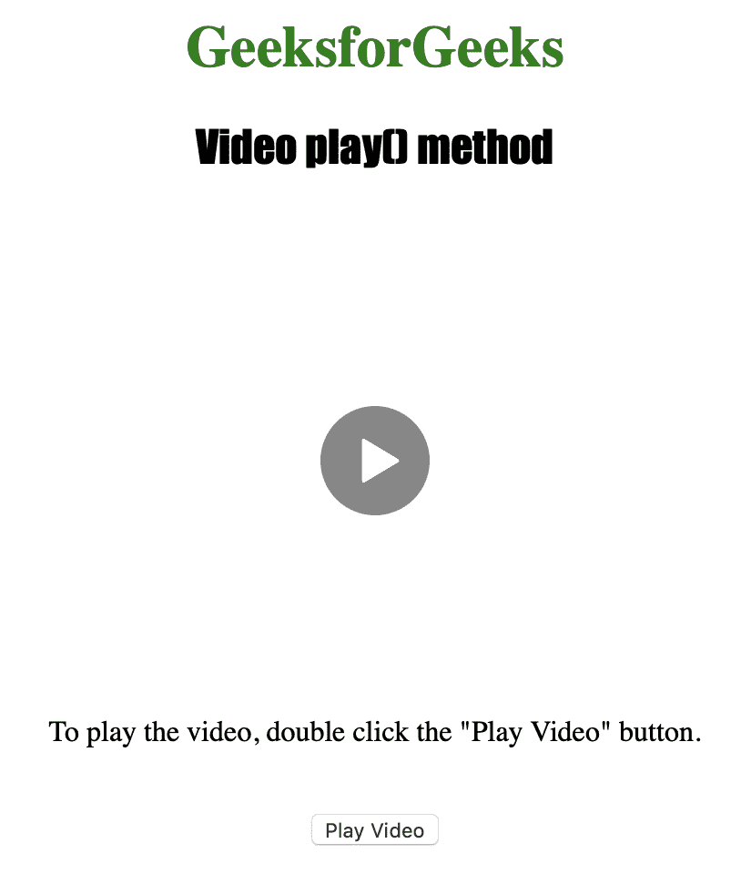
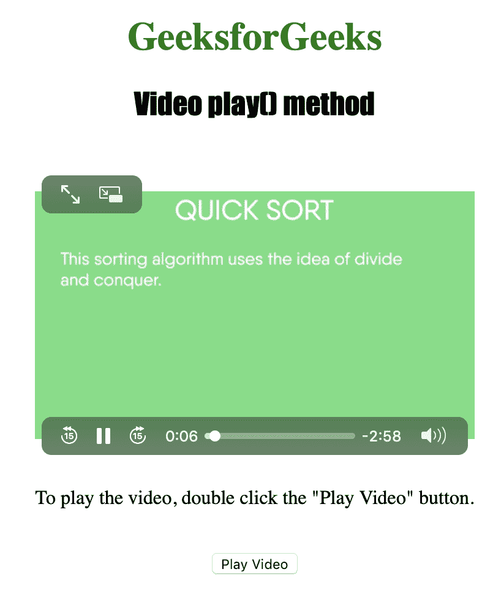

# HTML | DOM 视频播放( )方法

> 原文:[https://www.geeksforgeeks.org/html-dom-video-play-method/](https://www.geeksforgeeks.org/html-dom-video-play-method/)

**视频播放()**方法用于*开始播放当前视频*。若要使用 Video play()方法，必须使用 controls 属性来显示视频上附加的视频控件，如播放、暂停、搜索、音量等。

**语法:**

```html
videoObject.play()
```

**注意:**Video play()方法不接受任何参数，也不返回值。

下面的程序说明了视频播放()方法:
**示例:**用播放按钮播放视频。

```html
<!DOCTYPE html>
<html>

<head>
    <title>
        DOM Video play( ) Method
    </title>
</head>

<body style="text-align:center">

    <h1 style="color:green">
      GeeksforGeeks
    </h1>
    <h2 style="font-family: Impact">
      Video play() method
    </h2>
    <br>

    <video id="Test_Video" 
           width="360"
           height="240" 
           controls>

        <source id="mp4_source" 
                src="sample2.mp4"
                type="video/mp4">

        <source id="ogg_source" 
                src="sample2.ogg" 
                type="video/ogg">
    </video>

    <p>To play the video, double
      click the "Play Video" button.</p>
    <br>

    <button ondblclick="My_Video()" 
            type="button">
      Play Video
    </button>

    <script>
        var v =
            document.getElementById("Test_Video");

        function My_Video() {
            v.play();
        }
    </script>

</body>

</html>
```

**输出:**

*   点击按钮前:
    
*   点击按钮后:
    

**支持的浏览器:**以下是 *HTML | DOM 视频播放( )方法*支持的浏览器:

*   谷歌 Chrome
*   微软公司出品的 web 浏览器
*   火狐浏览器
*   歌剧
*   苹果 Safari