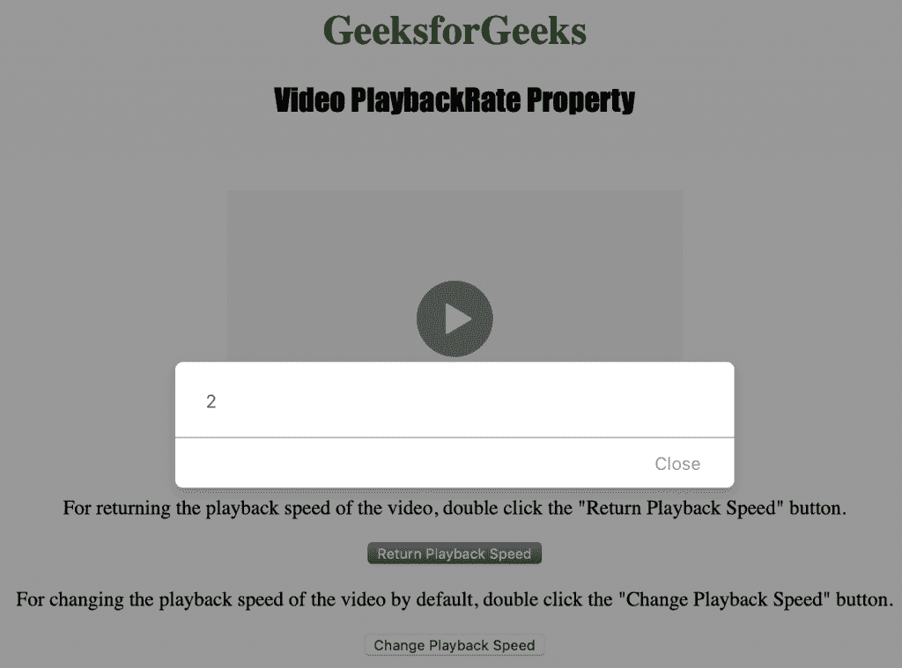

# HTML | DOM 视频播放包属性

> 原文:[https://www . geesforgeks . org/html-DOM-video-playback rate-property/](https://www.geeksforgeeks.org/html-dom-video-playbackrate-property/)

HTML DOM 中的**视频回放速率属性**用于设置或返回视频的当前回放速度。视频回放速率属性返回一个代表当前回放速度的数字。

**语法:**

*   它返回视频回放速率属性。

    ```html
    videoObject.playbackRate
    ```

*   它用于设置视频回放速率属性。

    ```html
    videoObject.playbackRate = playbackspeed
    ```

**属性值:**包含单值**回放速度**，指定视频的默认回放速度。可用选项包括:

*   1.0 是正常速度。
*   0.5 是半速。
*   2.0 是双倍速度。
*   -1.0 是倒退，正常速度。
*   -0.5 是倒退，半速。

**返回值:**返回一个代表当前播放速度的数字

下面的程序说明了 HTML DOM 中的视频回放速率属性:

**示例:**本示例将视频播放速度设置为两倍。

```html
<!DOCTYPE html>
<html>

<head>     
    <title>
        HTML DOM Video playbackRate Property
    </title>
</head>

<body style="text-align:center;">

    <h1 style="color:greenl">
        GeeksforGeeks
    </h1> 

    <h2 style="font-family: Impact;">
        Video PlaybackRate Property
    </h2><br>

    <video id="Test_Video" width="360" height="240" controls>
        <source src="samplevideo.mp4" type="video/mp4">
        <source src="movie.ogg" type="video/ogg">
    </video>

    <p>
        For returning the playback speed of the video,
        double click the "Return Playback Speed" button.
    </p>

    <button ondblclick="My_VideoRate()" type="button">
        Return Playback Speed
    </button>

    <p>
        For changing the playback speed of the video by default,
        double click the "Change Playback Speed" button.
    </p>

    <button ondblclick="Set_VideoRate()" type="button">
        Change Playback Speed
    </button>

    <script>
        var v = document.getElementById("Test_Video");

        function My_VideoRate() { 
            alert(v.playbackRate);
        } 

        function Set_VideoRate() { 
            v.playbackRate = 2;
        } 
    </script>
</body>

</html>                                                         
```

**输出:**

*   加载代码后:
    
*   初始播放速率:
    
*   更新播放速率:
    

**支持的浏览器:***视频播放包属性*支持的浏览器如下:

*   谷歌 Chrome
*   Internet Explorer 9.0/li >
*   火狐浏览器
*   歌剧
*   苹果 Safari