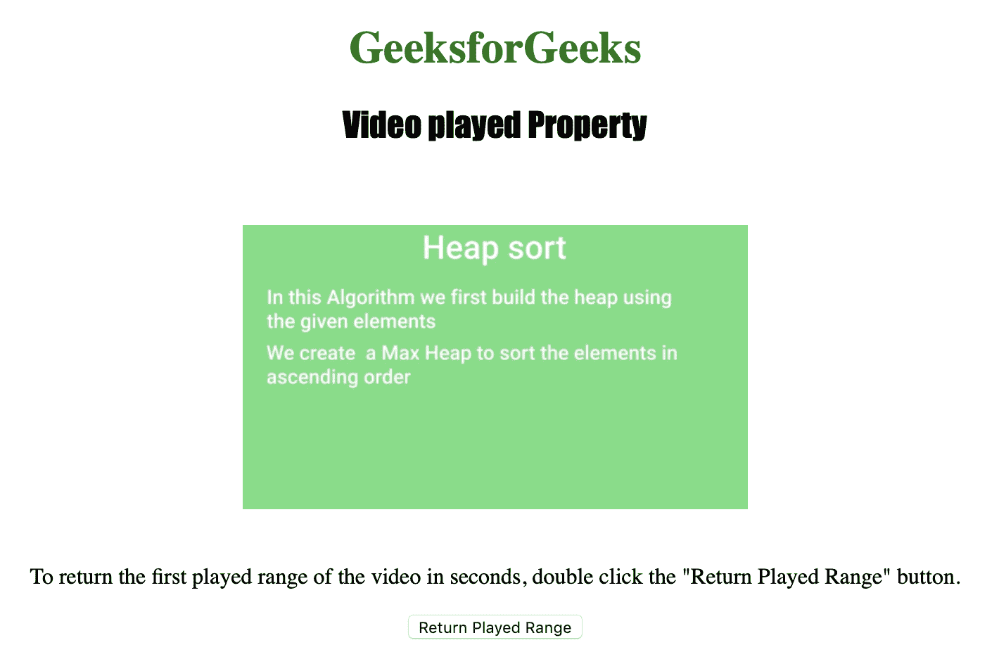
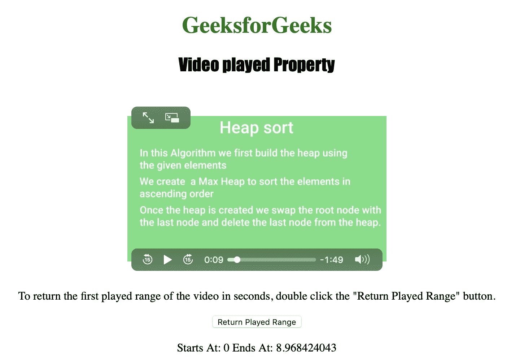

# HTML | DOM 视频播放属性

> 原文:[https://www . geesforgeks . org/html-DOM-video-played-property/](https://www.geeksforgeeks.org/html-dom-video-played-property/)

**视频播放属性**用于*返回一个时间范围对象*。
时间范围对象**用于想要表示用户已经播放的视频范围的情况。
播放范围是播放视频的时间范围。如果用户跳过视频，他可能会获得几个播放范围。
视频播放属性为只读属性。
时间范围对象属性包括:**

*   长度:用于获取视频中播放范围的数量
*   开始(索引):用于获取播放范围的开始位置
*   end(index):用于获取播放范围的结束位置

**语法:**

```html
videoObject.played
```

下面的程序说明了视频播放属性:
**示例:**以秒为单位获取视频的第一个播放范围。

```html
<!DOCTYPE html>
<html>

<head>
    <title>
        HTML | DOM Video played Property
    </title>
    <style>
        h1 {
            color: green;
        }

        h2 {
            font-family: Impact;
        }

        body {
            text-align: center;
        }
    </style>
</head>

<body>

    <h1>GeeksforGeeks</h1>
    <h2>Video played Property</h2>
    <br>

    <video id="Test_Video" 
           width="360" 
           height="240" 
           controls>
        <source src="samplevideo.mp4" 
                type="video/mp4">
        <source src="movie.ogg" 
                type="video/ogg">
    </video>

    <p>
      To return the first played range of the video
      in seconds, double click the
      "Return Played Range" button.
    </p>

    <button ondblclick="My_VideoRate()" 
            type="button">
      Return Played Range
    </button>

    <p id="test"></p>

    <script>
        function My_VideoRate() {
            var v = document.getElementById("Test_Video");

            document.getElementById("test").innerHTML = 
              "Starts At: " + v.played.start(0) +
              " Ends At: " + v.played.end(0);
        }
    </script>

</body>

</html>
```

**输出:**

*   点击按钮前:
    *   After clicking the button:
    

    **支持的浏览器:***HTML | DOM 视频播放属性*支持的浏览器如下:

    *   谷歌 Chrome
    *   微软公司出品的 web 浏览器
    *   火狐浏览器
    *   歌剧
    *   苹果 Safari