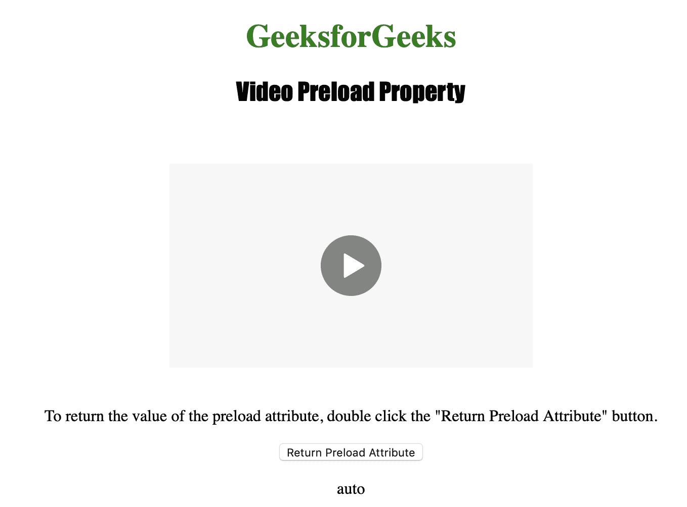
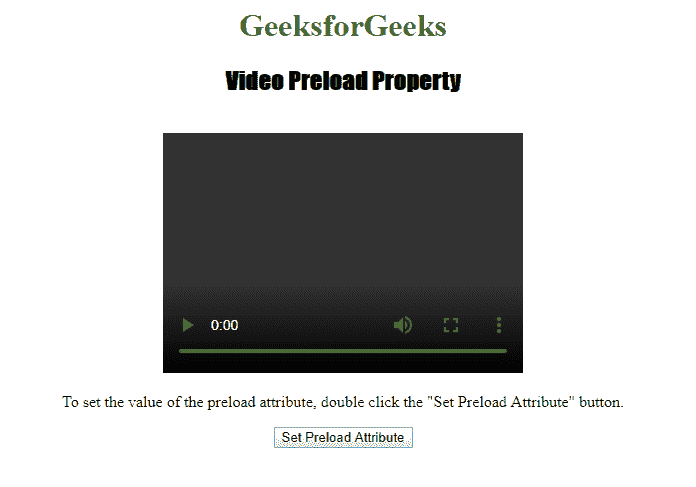
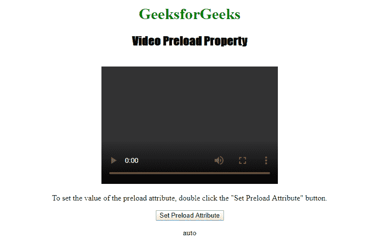

# HTML | DOM 视频预加载属性

> 原文:[https://www . geesforgeks . org/html-DOM-video-preload-property/](https://www.geeksforgeeks.org/html-dom-video-preload-property/)

**视频预载属性**用于**设置**或**返回** *视频的预载属性*的值。preload 属性用于指定页面加载时作者认为应该加载视频的方式。
视频预载属性允许作者向浏览器描绘网站的用户体验应该如何实现。
**语法:**

*   返回预加载属性:

```html
videoObject.preload
```

*   设置预载属性:

```html
videoObject.preload = "auto|metadata|none"
```

**房产价值:**

*   **auto :** 用于指定页面加载时浏览器应加载整个视频。
*   **元数据:**用于指定页面加载时浏览器只加载元数据。
*   **无:**用于指定页面加载时浏览器不应加载视频。

**返回值:**返回一个字符串值，代表应该预加载哪些数据(如果有)。可能的返回值是“自动”、“元数据”或“无”。请参阅“属性值”了解这些值的含义

下面的程序说明了视频预加载属性。
**示例-1:** 返回视频预加载属性。

## 超文本标记语言

```html
<!DOCTYPE html>
<html>

<head>
    <title>
        Video Preload Property
    </title>
</head>

<body style="text-align:center">

    <h1 style="color:green">
      GeeksforGeeks
    </h1>
    <h2 style="font-family: Impact">
      Video Preload Property
    </h2>
    <br>

    <video id="Test_Video"
           width="360"
           height="240"
           controls>
        <source src="samplevideo.mp4"
                type="video/mp4">

        <source src="movie.ogg"
                type="video/ogg">
    </video>

<p>To return the value of the preload attribute,
      double click the "Return Preload Attribute" button.</p>

    <button ondblclick="My_Video()"
            type="button">
      Return Preload Attribute
    </button>

    <p id="test"></p>

    <script>
        function My_Video() {
            var v = document.getElementById(
              "Test_Video").preload;
            document.getElementById("test").innerHTML = v;
        }
    </script>

</body>

</html>
```

**输出:**

*   点击按钮前:


*   点击按钮后:



**示例-2:** 设置视频预加载属性。

## 超文本标记语言

```html
<!DOCTYPE html>
<html>

<head>
    <title>
        Video Preload Property
    </title>
</head>

<body style="text-align:center">

    <h1 style="color:green">
      GeeksforGeeks
    </h1>
    <h2 style="font-family: Impact">
      Video Preload Property
    </h2>
    <br>

    <video id="Test_Video"
           width="360"
           height="240"
           controls>
        <source src="samplevideo.mp4"
                type="video/mp4">

        <source src="movie.ogg"
                type="video/ogg">
    </video>

<p>To set the value of the preload attribute,
      double click the "Set Preload Attribute" button.</p>

    <button ondblclick="My_Video()"
            type="button">
      Set Preload Attribute
    </button>

    <p id="test"></p>

    <script>
        function My_Video() {
            var v = document.getElementById(
              "Test_Video").preload="auto";
            document.getElementById("test").innerHTML = v;
        }
    </script>

</body>

</html>
```

**输出:**

*   点击按钮前:



*   点击按钮后:



**支持的浏览器:**以下是 *HTML | DOM 视频预加载属性*支持的浏览器:

*   谷歌 Chrome
*   微软公司出品的 web 浏览器
*   火狐浏览器
*   歌剧
*   苹果 Safari