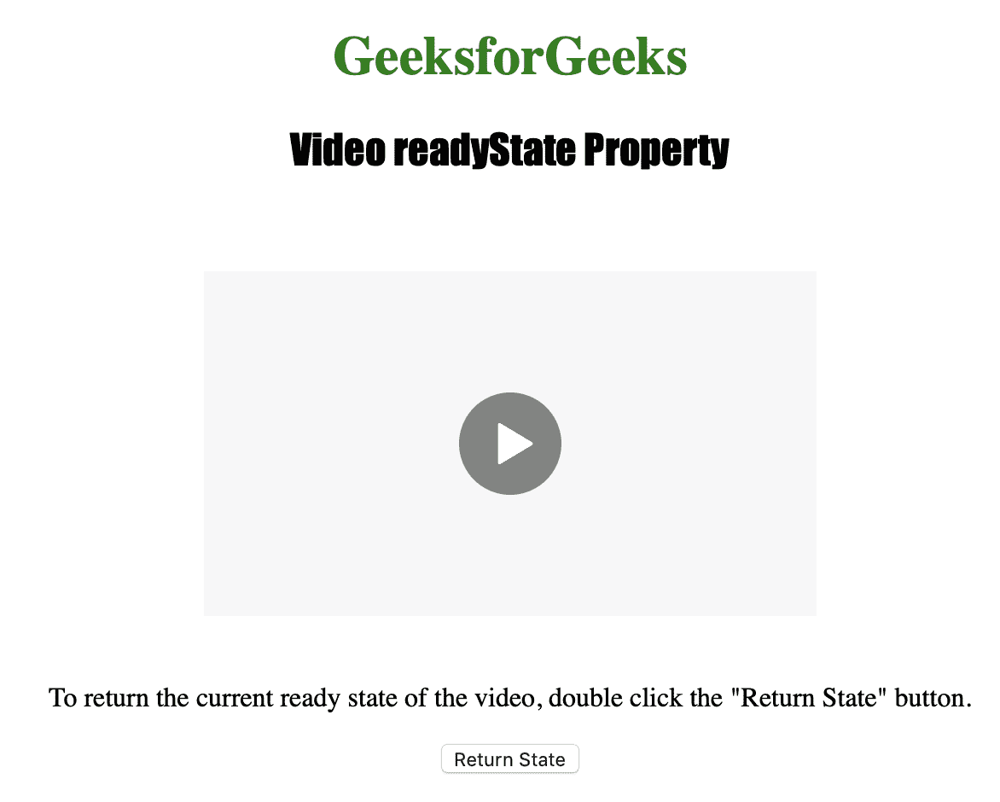
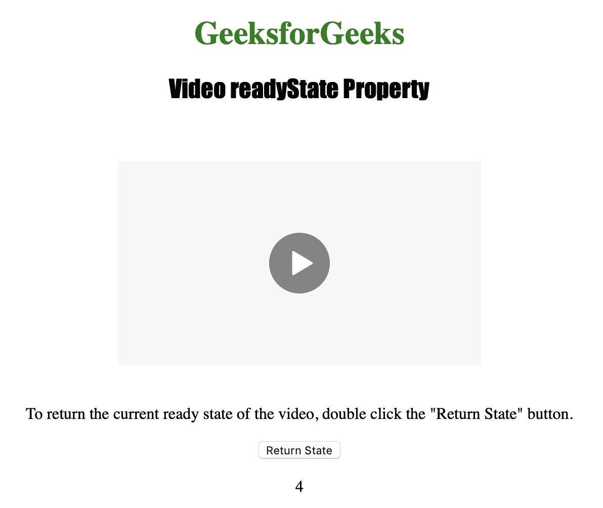

# HTML | DOM 视频 readyState 属性

> 原文:[https://www . geesforgeks . org/html-DOM-video-readystate-property/](https://www.geeksforgeeks.org/html-dom-video-readystate-property/)

**视频就绪状态属性**用于**返回** *视频的当前就绪状态*。就绪状态用于指示视频是否准备好播放。
视频就绪状态属性是只读属性。

**语法:**

```html
videoObject.readyState
```

**返回值:**描述不同就绪状态的各种数字有:

*   **0 = HAVE_NOTHING:** 没有与视频是否准备好相关的信息。
*   **1 = HAVE_METADATA:** 表示视频的元数据准备好了。
*   **2 = HAVE_CURRENT_DATA:** 表示当前播放位置的数据可用，但没有足够的数据播放下一帧/毫秒。
*   **3 = HAVE_FUTURE_DATA:** 表示当前帧和至少下一帧的数据可用。
*   **4 = HAVE _ total _ DATA**告知有足够的数据可以开始播放。

下面的程序说明了视频就绪状态属性。
**示例:**获取视频的当前就绪状态。

```html
<!DOCTYPE html>
<html>

<head>
    <title>
        Video readyState Property
    </title>
</head>

<body style="text-align:center">

    <h1 style="color:green">
      GeeksforGeeks
    </h1>
    <h2 style="font-family: Impact">
      Video readyState Property
    </h2>
    <br>

    <video id="Test_Video" 
           width="360" 
           height="240"
           controls>
        <source src="samplevideo.mp4"
                type="video/mp4">
        <source src="movie.ogg"
                type="video/ogg">
    </video>

    <p>To return the current ready state of the
      video, double click the "Return State" button.</p>

    <button ondblclick="My_Video()" 
            type="button">
      Return State
    </button>

    <p id="test"></p>

    <script>
        function My_Video() {
            var v = document.getElementById(
              "Test_Video").readyState;
            document.getElementById("test").innerHTML = v;
        }
    </script>

</body>

</html>
```

**输出:**

*   点击按钮前:
    
*   点击按钮后:
    

**支持的浏览器:**以下是 *HTML | DOM 视频 readyState Property* 支持的浏览器:

*   谷歌 Chrome
*   边缘
*   火狐浏览器
*   歌剧
*   苹果 Safari