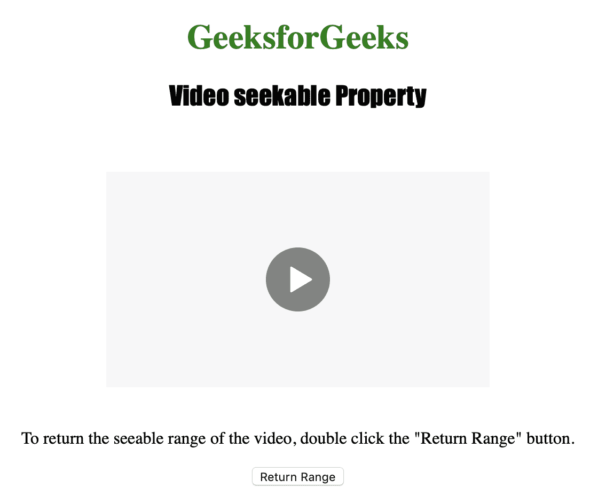
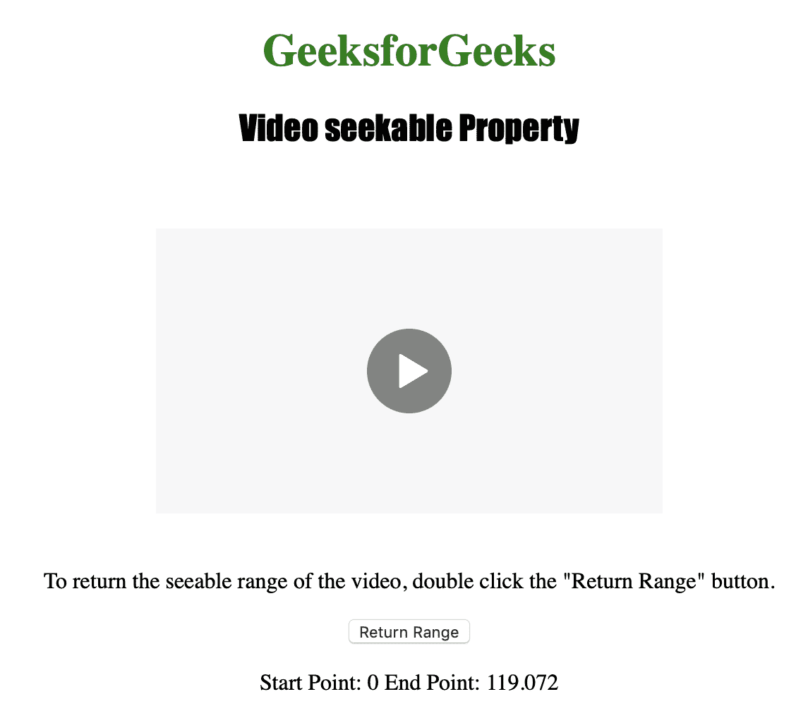

# HTML | DOM 视频可搜索属性

> 原文:[https://www . geesforgeks . org/html-DOM-video-seekable-property/](https://www.geeksforgeeks.org/html-dom-video-seekable-property/)

**视频可搜索属性**用于**返回** *一个时间范围对象*。时间范围对象用于表示可供用户搜索的视频范围。
可用于搜索(即移动回放位置)的视频时间范围称为可搜索范围。
如果是非流式视频，即使在视频被缓冲之前，也经常可以在视频中的任何位置进行搜索。
视频可搜索属性是只读属性。
对象属性的时间范围为:

*   长度:用于获取视频中播放范围的数量
*   开始(索引):用于获取播放范围的开始位置
*   end(index):用于获取播放范围的结束位置

**语法:**

```html
videoObject.seekable
```

下面的程序说明了视频可搜索属性。
**示例:**在几秒钟内获得视频的第一个可搜索范围。

```html
<!DOCTYPE html>
<html>

<head>
    <title>
        Video seekable Property
    </title>
</head>

<body style="text-align: center">

    <h1 style="color: green">
      GeeksforGeeks
    </h1>
    <h2 style="font-family: Impact">
      Video seekable Property
    </h2>
    <br>

    <video id="Test_Video"
           width="360" 
           height="240" 
           controls>
        <source src="samplevideo.mp4" 
                type="video/mp4">
        <source src="movie.ogg" 
                type="video/ogg">
    </video>

<p>To return the seeable range of the video,
      double click the "Return Range" button.</p>

    <button ondblclick="My_Video()" 
            type="button">
      Return Range
    </button>

    <p id="test"></p>

    <script>
        function My_Video() {
            var v = document.getElementById("Test_Video");

            document.getElementById("test").innerHTML =
                "Start Point: " + v.seekable.start(0) +
                " End Point: " + v.seekable.end(0);
        }
    </script>

</body>

</html>
```

**输出:**

*   点击按钮前:



*   点击按钮后:



**支持的浏览器:***HTML | DOM 视频可搜索属性*支持的浏览器如下:

*   谷歌 Chrome
*   微软公司出品的 web 浏览器
*   火狐浏览器
*   歌剧
*   苹果 Safari