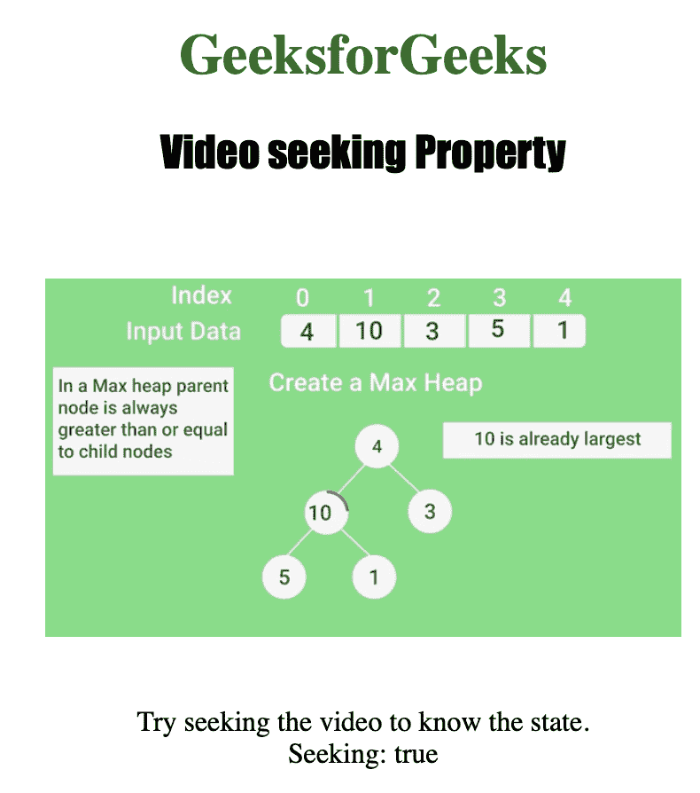

# HTML | DOM 视频搜索属性

> 原文:[https://www . geesforgeks . org/html-DOM-video-seeking-property/](https://www.geeksforgeeks.org/html-dom-video-seeking-property/)

**视频搜索属性**用于用户当前在视频中搜索时**返回** *。
当用户移动或跳转到视频中的新位置时，称为寻找。
视频搜索属性是只读属性。*

**语法:**

```html
videoObject.seeking
```

**返回值:**
如果用户当前正在搜索，视频搜索属性返回布尔值 true，否则返回 false。

下面的程序说明了视频搜索属性。

**示例:**显示用户当前是否在视频中寻找。

## 超文本标记语言

```html
<!DOCTYPE html>
<html>

<head>
    <title>
        Video seeking Property
    </title>
</head>

<body style="text-align:center">

    <h1 style="color:green">GeeksforGeeks</h1>
    <h2 style="font-family: Impact">
      Video seeking Property
    </h2>
    <br>

    <video id="Test_Video"
           width="360"
           height="240"
           controls onseeking="My_Video()"
           onseeked="myFunction()">

        <source src="samplevideo.mp4"
                type="video/mp4">
        <source src="movie.ogg"
                type="video/ogg">
    </video>

<p>Try seeking the video to know the state.
        <br><span id="Test_Span">
      </span></p>

    <p id="test"></p>

    <script>
        function My_Video() {
            var v = document.getElementById("Test_Video");
            document.getElementById("Test_Span").innerHTML =
              ("Seeking: " + v.seeking);
        }
    </script>

</body>

</html>
```

**输出:**

*   在单击按钮之前:


*   单击按钮后:



**支持的浏览器:**支持的浏览器 *HTML | DOM 视频搜索属性*如下:

*   谷歌 Chrome
*   微软公司出品的 web 浏览器
*   火狐浏览器
*   歌剧
*   苹果 Safari