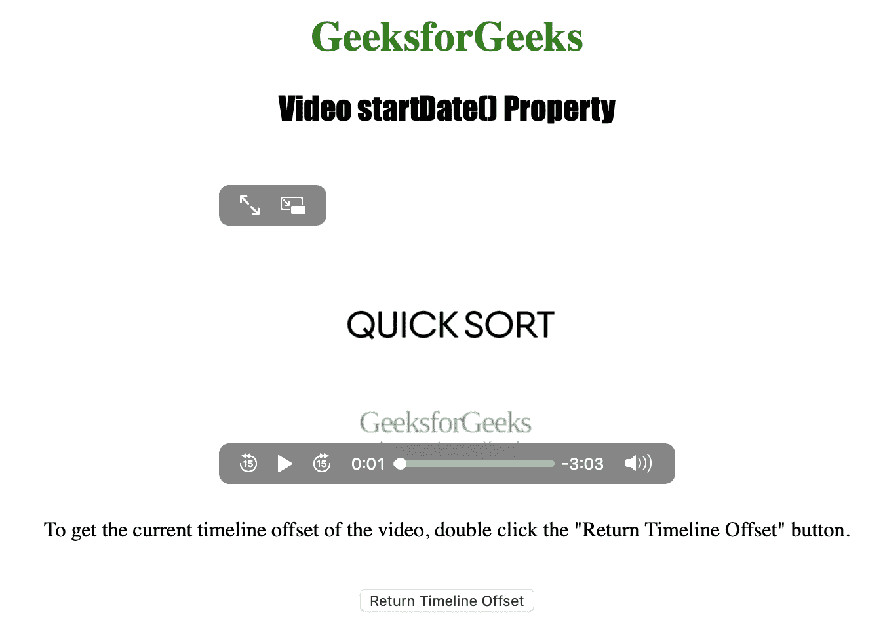
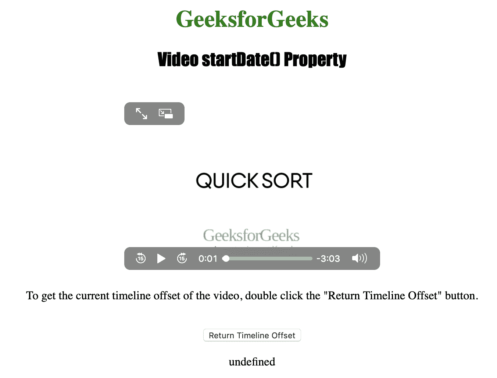

# HTML | DOM 视频开始日期属性

> 原文:[https://www . geesforgeks . org/html-DOM-video-start date-property/](https://www.geeksforgeeks.org/html-dom-video-startdate-property/)

**视频开始日期属性**用于*返回一个日期对象，该对象代表视频*的当前时间线偏移。“视频开始日期”属性的应用程序用于实现互联网上视频直播的精确同步。

**语法:**

```html
videoObject.startDate
```

下面的程序说明了视频开始日期()属性:
**示例:**获取视频的当前时间线偏移。

```html
<!DOCTYPE html>
<html>

<head>
    <title>
         Video startDate() Property
    </title>
</head>

<body style="text-align: center">

    <h1 style="color: green">
      GeeksforGeeks
    </h1>
    <h2 style="font-family: Impact">
      Video startDate() Property
    </h2>
    <br>

    <video id="Test_Video" 
           width="360" 
           height="240" 
           controls>

        <source id="mp4_source" 
                src="sample2.mp4" 
                type="video/mp4">

        <source id="ogg_source" 
                src="sample2.ogg" 
                type="video/ogg">
    </video>

    <p>To get the current timeline offset of
      the video, double click the "Return 
      Timeline Offset" button.</p>
    <br>

    <button ondblclick="My_Video()">
      Return Timeline Offset
    </button>

    <p id="test"></p>

    <script>
        function My_Video() {
            var v =
                document.getElementById(
                  "Test_Video").startDate;

            document.getElementById(
              "test").innerHTML = v;
        }
    </script>

</body>

</html>
```

**输出:**

*   点击按钮前:
    
*   点击按钮后:
    

**支持的浏览器:**主要浏览器不支持 *HTML | DOM 视频开始日期属性*。