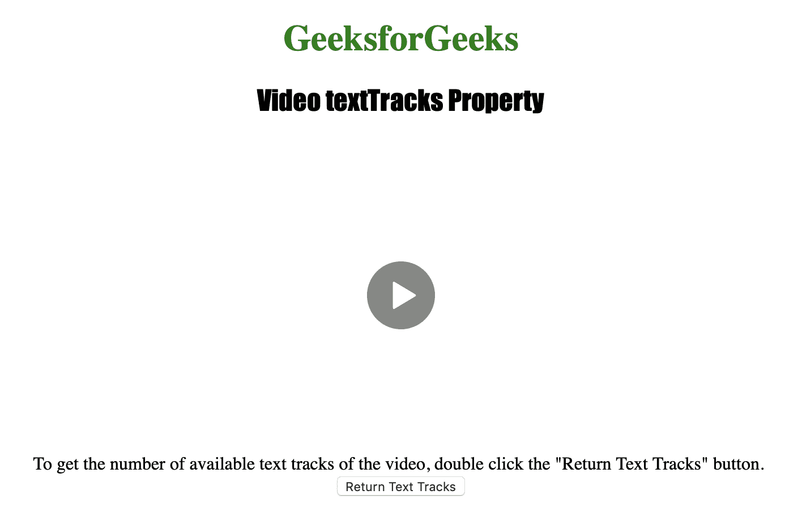
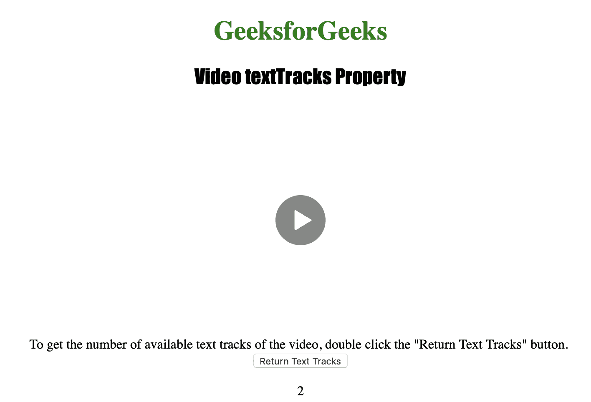

# HTML | DOM 视频文本轨迹属性

> 原文:[https://www . geesforgeks . org/html-DOM-video-text tracks-property/](https://www.geeksforgeeks.org/html-dom-video-texttracks-property/)

**视频文本跟踪属性**用于**返回** *一个文本跟踪列表对象*。
TextTrackList 对象用于表示视频的可用文本轨道。
每个可用的文本轨道由一个单独的文本轨道对象表示。

**语法:**

```html
videoObject.textTracks
```

**返回值**

1.  **文本轨迹列表对象:**表示视频可用的文本轨迹。
    *   **长度:**用于获取视频中可用的文本轨道数。
    *   **【索引】:**用于通过索引获取 TextTrack 对象。
2.  **TextTrack 对象:表示一个文本轨迹。**
    *   **种类:**用于获取文字轨迹的类型。
    *   **标签:**用于获取文本轨道的标签。
    *   **语言:**用于获取文本轨迹的语言。
    *   **模式:**用于获取或设置轨道是否激活。
    *   **提示:**用于获取一个作为 TextTrackCueList 对象的提示列表。
    *   **活动线索:**用于获取当前活动的文本轨迹线索，作为 TextTrackCueList 对象。
    *   **添加提示(cue):** 用于向提示列表中添加提示。
    *   **移除提示(cue):** 用于从提示列表中移除提示。

下面的程序说明了视频文本轨道属性:
**示例:**获取可用文本轨道的数量。

```html
<!DOCTYPE html>
<html>

<head>
    <title>
        Video textTracks Property
    </title>
</head>

<body style="text-align: center">

    <h1 style="color: green">GeeksforGeeks</h1>
    <h2 style="font-family: Impact">
      Video textTracks Property
  </h2>
    <br>

    <video id="Test_Video" 
           width="360" 
           height="240"
           controls>

        <source src="sample2.mp4" 
                type="video/mp4">
        <source src="sample2.ogg" 
                type="video/ogg">
        <track src="testsub.vtt">
            <track src="testsub2.srt">
    </video>

    <p>To get the number of available text tracks of the 
      video, double click the "Return Text Tracks" button.
        <br>

        <button ondblclick="My_Video()">
          Return Text Tracks
      </button>

        <p id="test"></p>

        <script>
            function My_Video() {
                var v = document.getElementById(
                  "Test_Video").textTracks.length;
                document.getElementById("test").innerHTML = v;
            }
        </script>

</body>

</html>
```

**输出:**

*   点击按钮前:
    
*   点击按钮后:
    

**支持的浏览器:**以下列出了 *HTML | DOM 视频文本跟踪属性*支持的浏览器:

*   谷歌 Chrome
*   微软公司出品的 web 浏览器
*   歌剧
*   苹果 Safari