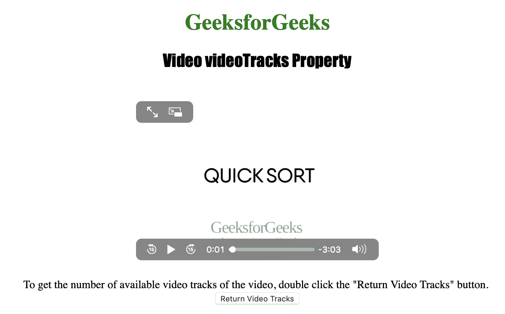
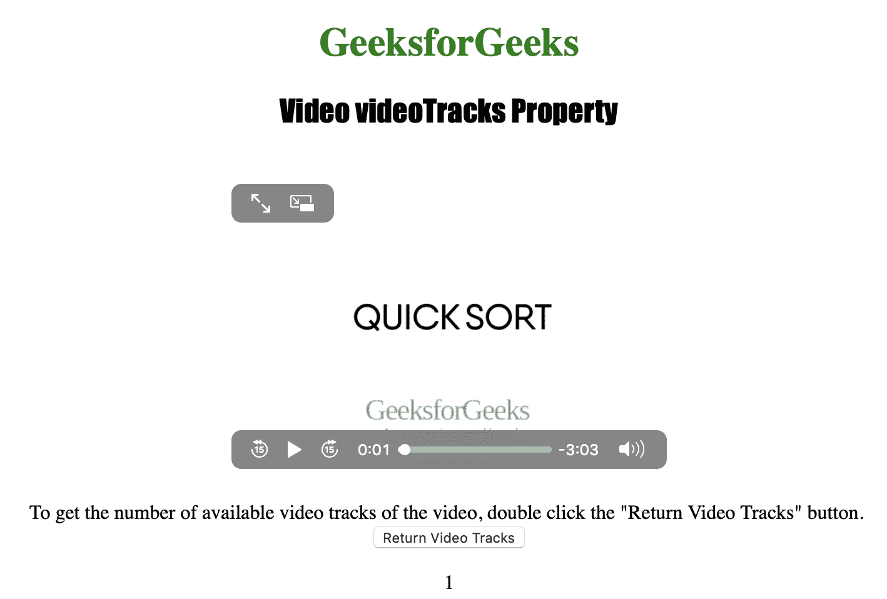

# HTML | DOM 视频录像机属性

> 原文:[https://www . geesforgeks . org/html-DOM-video-video tracks-property/](https://www.geeksforgeeks.org/html-dom-video-videotracks-property/)

**视频跟踪属性**用于**返回** *一个视频跟踪列表对象*。视频跟踪列表对象通常用于表示视频可用的视频轨道。
每个可用的视频轨道由一个单独的视频轨道对象表示。

**语法:**

```html
videoObject.videoTracks
```

**返回值:**

1.  **视频轨道列表对象:**表示视频的可用视频轨道。
    *   **videoTracks.length:** 用于获取视频中可用的文本轨道数。
    *   **视频跟踪[索引]:** 用于通过索引获取视频跟踪对象。
    *   **视频轨道列表对象:**用于表示视频的可用视频轨道。
    *   **vIdeo tracks . gettrackbyid(id):**用于按 id 获取 VideoTrack 对象。
2.  **视频轨道对象:表示视频轨道。**
    *   **种类:**用于获取视频轨道的类型。
    *   **标签:**用于获取视频轨道的标签。
    *   **语言:**用于获取视频文字轨迹的语言。
    *   **id:** 用于获取视频轨道的 id。
    *   **选中:**用于获取或设置轨道是否激活。

以下程序说明了视频录像架属性:

**示例:**获取可用视频轨道数。

## 超文本标记语言

```html
<!DOCTYPE html>
<html>

<head>
    <title>
        DOM Video videoTracks Property
    </title>
</head>

<body style="text-align: center">

    <h1 style="color: green">
      GeeksforGeeks
  </h1>
    <h2 style="font-family: Impact">
      Video videoTracks Property
  </h2>
    <br>

    <video id="Test_Video"
           width="360"
           height="240"
           controls>
        <source src="sample2.mp4"
                type="video/mp4">

        <source src="sample2.ogg"
                type="video/ogg">
    </video>

<p>To get the number of available video tracks of
      the video, double click the "Return Video Tracks" button.
        <br>

        <button ondblclick="My_Video()">
          Return Video Tracks
      </button>

        <p id="test"></p>

        <script>
            function My_Video() {
                var v = document.getElementById(
                  "Test_Video").videoTracks.length;
                document.getElementById("test").innerHTML = v;
            }
        </script>

</body>

</html>
```

**输出:**

*   在单击按钮之前:



*   单击按钮后:



**支持的浏览器:**主要浏览器不支持 *HTML | DOM 视频录像库属性*。

*   谷歌 Chrome
*   微软公司出品的 web 浏览器
*   火狐浏览器
*   歌剧
*   苹果 Safari