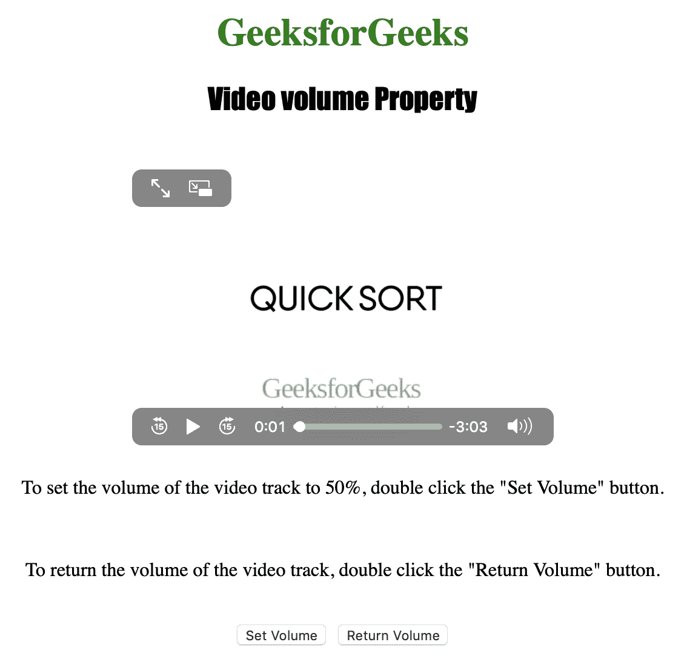
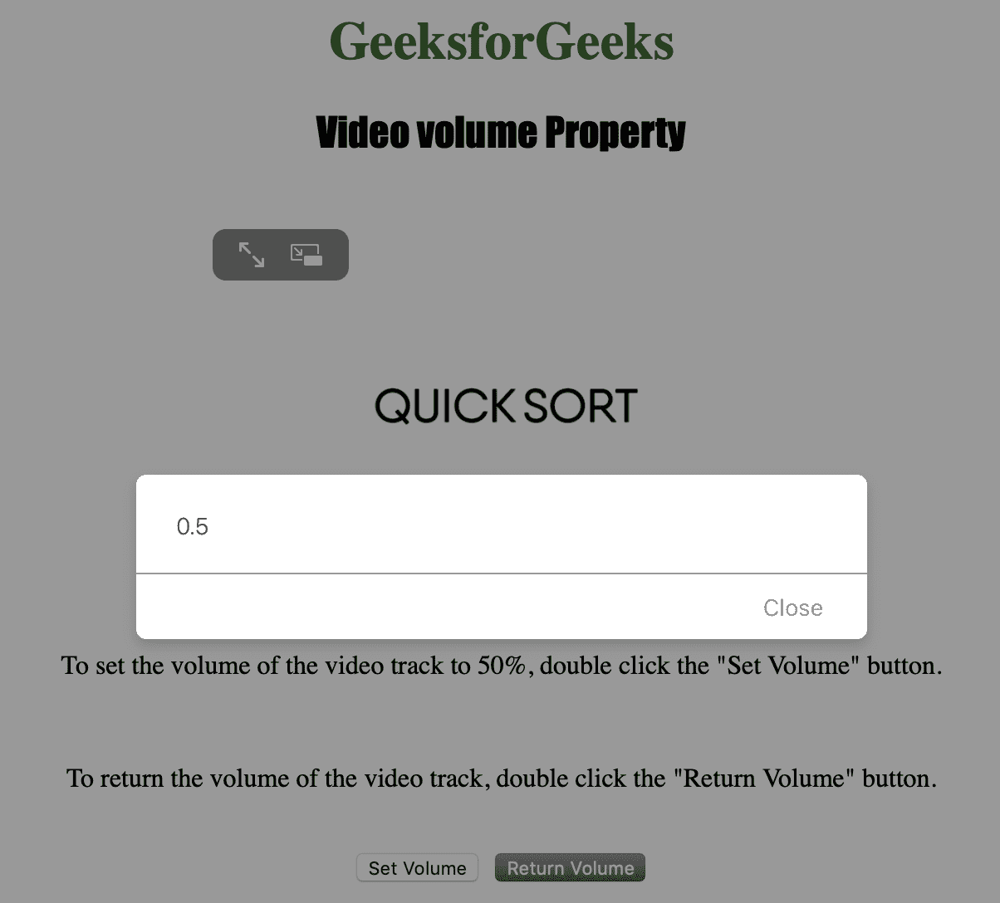

# HTML | DOM 视频卷属性

> 原文:[https://www . geesforgeks . org/html-DOM-video-volume-property/](https://www.geeksforgeeks.org/html-dom-video-volume-property/)

**视频音量属性**用于**设置**或**返回** *视频的音频音量*。
视频音量属性接受的值范围介于 0.0(静音)和 1.0(最大声)之间。

**语法:**

*   返回音量属性:

    ```html
    videoObject.volume
    ```

*   设置音量属性:

    ```html
    videoObject.volume = number
    ```

**属性值:**

*   **1.0:** 这是最高音量。它也是默认值。
*   **0.5:** 用于半容积。
*   **0.0:** 用于指定零音量/静音/静音。

**返回:**视频音量属性返回一个代表视频音量的数字。

下面的程序说明了视频音量属性:
**示例:**将视频音量设置为 50%。

```html
<!DOCTYPE html>
<html>

<head>
    <title>
        DOM Video volume Property
    </title>
</head>

<body style="text-align: center">

    <h1 style="color: green">
      GeeksforGeeks
    </h1>
    <h2 style="font-family: Impact">
      Video volume Property
    </h2>
    <br>

    <video id="Test_Video" 
           width="360"
           height="240" 
           controls>
        <source src="sample2.mp4" 
                type="video/mp4">
        <source src="sample2.ogg" 
                type="video/ogg">
    </video>

    <p>To set the volume of the video 
      track to 50%, double click the 
      "Set Volume" button.</p>
    <br>

    <p>To return the volume of the 
      video track, double click 
      the "Return Volume" button.</p>
    <br>

    <button ondblclick="My_Video()">
      Set Volume
    </button>
    <button ondblclick="R_Volume()">
      Return Volume
    </button>

    <script>
        var v = 
            document.getElementById("Test_Video");

        function My_Video() {
            v.volume = 0.5;
        }

        function R_Volume() {
            alert(v.volume);
        }
    </script>

</body>

</html>
```

**输出:**

*   点击按钮前:
    
*   点击按钮后:
    

**支持的浏览器:**以下是 *HTML | DOM 视频卷属性*支持的浏览器:

*   谷歌 Chrome
*   微软公司出品的 web 浏览器
*   火狐浏览器
*   歌剧
*   苹果 Safari