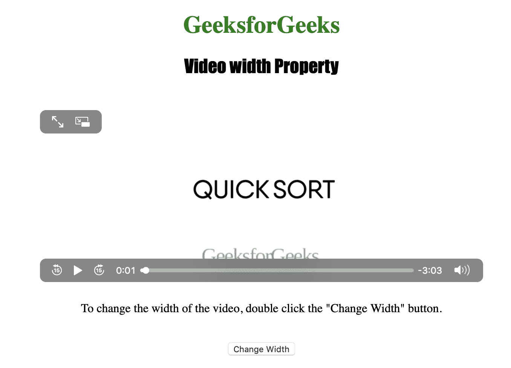

# HTML | DOM 视频宽度属性

> 原文:[https://www . geesforgeks . org/html-DOM-video-width-property/](https://www.geeksforgeeks.org/html-dom-video-width-property/)

**视频宽度属性**用于**设置**或**返回** *视频宽度属性的值*。
宽度属性用于指定视频播放器的宽度，以像素为单位。
视频宽度属性返回一个代表视频宽度的数字。
**语法:**
**返回宽度属性:**

```html
videoObject.width
```

**设置宽度属性:**

```html
videoObject.width = pixels
```

**房产价值**

*   **像素:**用于指定视频播放器的宽度，以像素为单位

**返回值:**返回表示视频元素宽度的字符串值。

下面的程序说明了视频宽度属性:
**示例:**改变视频播放器的宽度。

## 超文本标记语言

```html
<!DOCTYPE html>
<html>

<head>
    <title>
        DOM Video width Property
    </title>
</head>

<body style="text-align: center">

    <h1 style="color: green">
      GeeksforGeeks
  </h1>
    <h2 style="font-family: Impact">
      Video width Property
  </h2>
    <br>

    <video id="Test_Video" width="360"
           height="240" controls>
        <source src="sample2.mp4" type="video/mp4">
        <source src="sample2.ogg" type="video/ogg">
    </video>

<p>To change the width of the video,
      double click the "Change Width" button.</p>

    <br>

    <button ondblclick="My_Video()">Change Width
  </button>

    <script>
        function My_Video() {
            document.getElementById(
              "Test_Video").width = "600";
        }
    </script>

</body>

</html>
```

**输出:**
**点击按钮前:**


**点击按钮后:**



**支持的浏览器:**

*   苹果 Safari
*   微软公司出品的 web 浏览器
*   火狐浏览器
*   谷歌 Chrome
*   歌剧