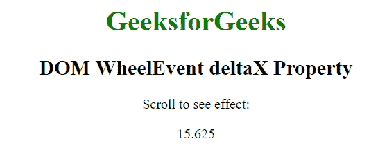

# HTML | DOM WheelEvent deltaX 属性

> 原文:[https://www . geesforgeks . org/html-DOM-wheel event-deltax-property/](https://www.geeksforgeeks.org/html-dom-wheelevent-deltax-property/)

HTML 中的 **WheelEvent.deltaX** 属性用于当网页向左或向右水平滚动时返回一个正的双精度值。如果页面向右滚动，它会返回一个正值，向左滚动时会返回一个双负值，否则它会返回零。它是只读属性。

**语法:**

```html
event.deltaX
```

**返回值:**返回一个双数值，表示鼠标滚轮的滚动方向。

*   双正值表示鼠标向右滚动。
*   双负值表示鼠标向左滚动。

**示例:**

```html
<!DOCTYPE html>
<html>
    <head>
        <title>DOM WheelEvent deltaX Property</title>
    </head>

    <body onwheel="Geeks(event)" 
          style="text-align: center; width: 1000px;">

    <h1 style="color: green;">
        GeeksforGeeks
    </h1>

    <h2>
        DOM WheelEvent deltaX Property
    </h2>

    <p>Scroll to see effect:</p>

    <p id="p"></p>

    <script>
        function Geeks(event) {
            var doc = event.deltaX;
            document.getElementById("p").innerHTML = doc;
        }
    </script>

    </body>
</html>                    
```

**输出:**

**支持的浏览器:**deltaX 属性支持的浏览器如下:

*   不支持苹果 Safari
*   谷歌 Chrome 31.0
*   Firefox 17.0
*   Opera 18.0
*   微软公司出品的 web 浏览器