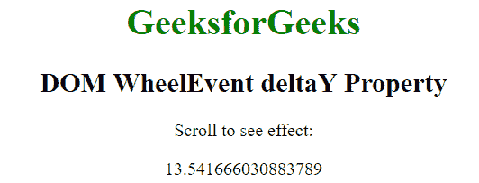

# HTML | DOM WheelEvent deltaY 属性

> 原文:[https://www . geesforgeks . org/html-DOM-wheel event-deltay-property/](https://www.geeksforgeeks.org/html-dom-wheelevent-deltay-property/)

HTML 中的 **WheelEvent.deltaY** 属性用来在网页向下滚动时返回正的双精度值，在页面向上滚动时返回负的双精度值，否则返回零。它是只读属性

**语法:**

```html
event.deltaY
```

**返回值:**返回一个双数值，表示鼠标滚轮的滚动方向。

*   双正值表示鼠标向下滚动。
*   双负值表示鼠标向上滚动。

**示例:**

```html
<!DOCTYPE html>
<html>
    <head>
        <title>DOM WheelEvent deltaY Property</title>
    </head>

    <body onwheel="Geeks(event)" 
          style="text-align:center; height: 5000px;">

    <h1 style="color: green;">
        GeeksforGeeks
    </h1>

    <h2>
        DOM WheelEvent deltaY Property
    </h2>

    <p>Scroll to see effect:</p>

    <p id="p"></p>

    <script>
        function Geeks(event) {
            var doc = event.deltaY;
            document.getElementById("p").innerHTML = doc;
        }
    </script>

    </body>
</html>                    
```

**输出:**


**支持的浏览器:**deltaY 属性支持的浏览器如下:

*   不支持苹果 Safari
*   谷歌 Chrome 31.0
*   Firefox 17.0
*   Opera 18.0
*   微软公司出品的 web 浏览器