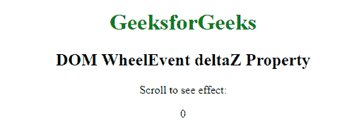

# HTML | DOM WheelEvent deltaZ 属性

> 原文:[https://www . geesforgeks . org/html-DOM-wheel event-deltaz-property/](https://www.geeksforgeeks.org/html-dom-wheelevent-deltaz-property/)

**HTML | DOM WheelEvent deltaZ 属性**用于当网页滚入时返回正的双精度值，当页面滚出时返回负值，否则返回零。它是只读属性。

**语法:**

```html
event.deltaZ
```

**返回值:**返回一个双数值，表示鼠标滚轮的滚动方向。

**示例:**

```html
<!DOCTYPE html>
<html>

<head>
    <title>
      DOM WheelEvent deltaZ Property
  </title>
</head>

<body onwheel="Geeks(event)" 
      style="text-align: center; 
             width: 1000px;">

    <h1 style="color: green;"> 
        GeeksforGeeks 
    </h1>

    <h2> 
        DOM WheelEvent deltaZ Property 
    </h2>

    <p>Scroll to see effect:</p>

    <p id="p"></p>

    <script>
        function Geeks(event) {
            var doc = event.deltaZ;
            document.getElementById(
              "p").innerHTML = doc;
        }
    </script>

</body>

</html>
```

**输出:**
**前滚:**


**卷轴后:**


**支持的浏览器:**T2 DOM WheelEvent deltaZ Property 支持的浏览器如下:

*   谷歌 Chrome
*   微软公司出品的 web 浏览器
*   火狐浏览器
*   歌剧