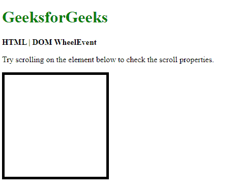
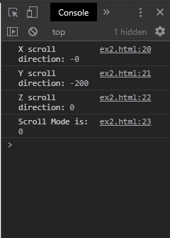
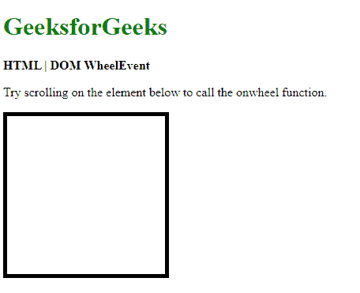
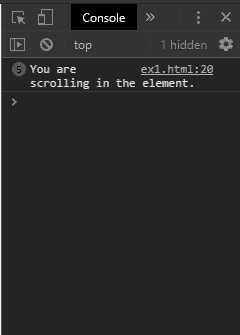

# HTML | DOM WheelEvent

> 原文:[https://www.geeksforgeeks.org/html-dom-wheelevent/](https://www.geeksforgeeks.org/html-dom-wheelevent/)

DOM WheelEvent 包含检测到滚动时发生的事件。它可以用来找出滚动的方向、量和方式。它有 **onwheel** 事件，每当滚动发生时都会调用该事件。

**属性:**

*   **deltaX:** 返回鼠标滚轮的水平滚动量，即在 x 轴上的滚动量。
*   **deltaY:** 返回鼠标滚轮在 y 轴上的垂直滚动量。
*   **deltaZ:** 返回鼠标滚轮 z 轴上的滚动量。
*   **增量模式:**返回用于增量值的测量单位。该值可以是像素、行或页面。

**示例:**本示例显示滚动属性。

```html
<!DOCTYPE html>
<html>

<head>
    <title>HTML DOM WheelEvent</title>

    <style>
        .area {
            height: 200px;
            width: 200px;
            border: 5px solid;
        }
    </style>
</head>

<body>
    <h1 style="color: green">
        GeeksforGeeks
    </h1>

    <b>HTML | DOM WheelEvent</b>

    <p>
        Try scrolling on the element below
        to check the scroll properties.
    </p>

    <div class="area" 
        onwheel="isScrolling(event)">
    </div>

    <script type="text/javascript">
        function isScrolling(event) {
            console.log("X scroll direction:", event.deltaX);
            console.log("Y scroll direction:", event.deltaY);
            console.log("Z scroll direction:", event.deltaZ);
            console.log("Scroll Mode is:", event.deltaMode);
        }
    </script>
</body>

</html>
```

**输出:**

*   **滚动 div 元素前:**
    
*   **滚动 div 元素后的控制台输出:**
    

**事件类型:**

*   **滚轮:**每当鼠标滚轮在元素上向上或向下滚动时，都会发生此事件。

**示例:**此示例说明了 onwheel 事件。

```html
<!DOCTYPE html>
<html>

<head>
    <title>onwheel event type</title>

    <style>
        .area {
            height: 200px;
            width: 200px;
            border: 5px solid;
        }
    </style>
</head>
<body>
    <h1 style="color: green">
        GeeksforGeeks
    </h1>

    <b>HTML | DOM WheelEvent</b>

    <p>
        Try scrolling on the element below
        to call the onwheel function.
    </p>

    <div class="area" 
        onwheel="isScrolling()">
    </div>

    <script type="text/javascript">
        function isScrolling() {
            console.log('You are scrolling"
                    + " in the element.')
        }
    </script>
</body>

</html>
```

**输出:**

*   **滚动 div 元素前:**
    
*   **滚动 div 元素后的控制台输出:**
    

**支持的浏览器:****HTML DOM wheel event**支持的浏览器如下:

*   谷歌 Chrome 31
*   Internet Explorer 9
*   Firefox 17
*   苹果 Safari
*   歌剧 18