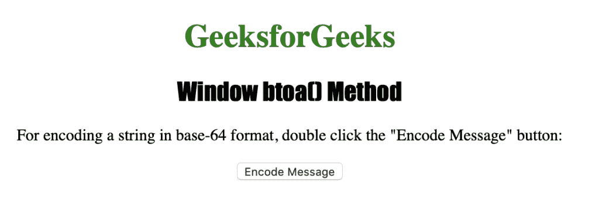
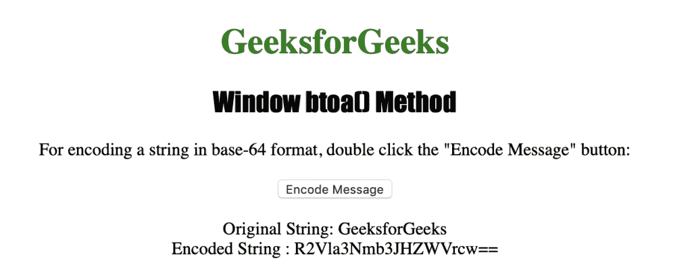

# HTML | DOM Window btoa()方法

> 原文:[https://www.geeksforgeeks.org/html-dom-window-btoa-method/](https://www.geeksforgeeks.org/html-dom-window-btoa-method/)

**Window btoa()方法**用于以 base-64 格式编码字符串。
Window btoa()方法用来编码字符串的字符有“a-z”、“A-Z”、“0-9”、“+”、“/”和“=”。
**语法:**

```html
window.btoa(String)
```

**使用的参数:**

*   **字符串:**是指定要编码的字符串的强制参数。

**返回值:**它返回一个字符串，该字符串表示 base-64 的编码字符串。

下面的程序说明了 Window btoa()方法:
**以 base-64 格式编码字符串。**T3】

## 超文本标记语言

```html
<!DOCTYPE html>
<html>

<head>
    <title>
      Window btoa() Method in HTML
    </title>
    <style>
        h1 {
            color: green;
        }

        h2 {
            font-family: Impact;
        }

        body {
            text-align: center;
        }
    </style>
</head>

<body>

    <h1>GeeksforGeeks</h1>
    <h2>Window btoa() Method</h2>

<p>
      For encoding a string in base-64 format,
      double click the "Encode Message" button:
    </p>

    <button ondblclick="encode()">
      Encode Message
    </button>

    <p id="myEncoding"></p>

    <script>
        function encode() {
            var original = "GeeksforGeeks";
            var encoded = window.btoa(original);

            var output = "Encoded String : " + encoded;
            document.getElementById("myEncoding").innerHTML =
              "Original String: " + original + "<br>" + output;
        }
    </script>

</body>

</html>
```

**输出:**



**点击**按钮后



**支持的浏览器:***Window btoa()方法*支持的浏览器如下:

*   谷歌 Chrome
*   微软公司出品的 web 浏览器
*   火狐浏览器
*   歌剧
*   旅行队