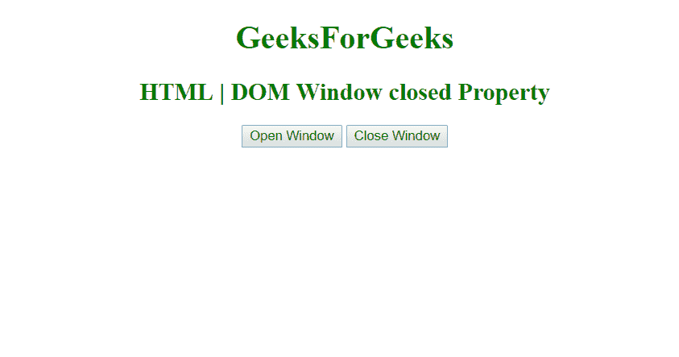

# HTML | DOM 窗口关闭属性

> 原文:[https://www . geesforgeks . org/html-DOM-window-closed-property/](https://www.geeksforgeeks.org/html-dom-window-closed-property/)

**HTML DOM** 中的**窗口关闭**属性用于返回一个值，该值指示**引用的窗口是否关闭**。

**语法:**

```html
window.close()
```

**返回值:**布尔值，如果窗口关闭则为真，否则为假。

**示例:**

```html
<!DOCTYPE html>
<html>

<head>
    <title>
        HTML | DOM Window closed Property
    </title>
    <style>
        h1,
        h2 {
            color: green;
        }

        body {
            text-align: center;
        }
    </style>
    <script>
        var gfgWindow;

        // function to open a window.
        function openWindow() {
            gfgWindow = window.open("",
             "Window", "width=400, height=200");
        }

        // function to close a window.
        function closeWindow() {
            if (gfgWindow) {
                gfgWindow.close();
            }
    alert("Window Closed");
        }
    </script>
</head>

<body>
    <h1>GeeksForGeeks</h1>
    <h2>HTML | DOM Window closed Property</h2>

    <!--Click on Open Window to open a Window-->
    <button onclick="openWindow()">
        Open Window
    </button>

    <!--Click on Close Window to close a Window-->
    <button onclick="closeWindow()">
        Close Window
    </button>

</body>

</html>
```

**输出:**

*   **初始:**
    
*   **窗口打开:**
    
*   **窗口关闭:**
    

**支持的浏览器:**T2 DOM Window 关闭属性支持的浏览器如下:

*   谷歌 Chrome
*   微软公司出品的 web 浏览器
*   火狐浏览器
*   歌剧
*   旅行队