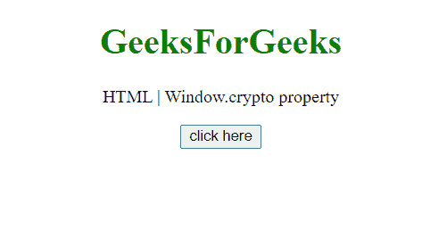
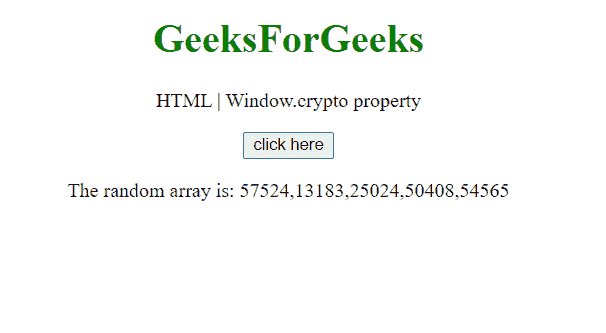
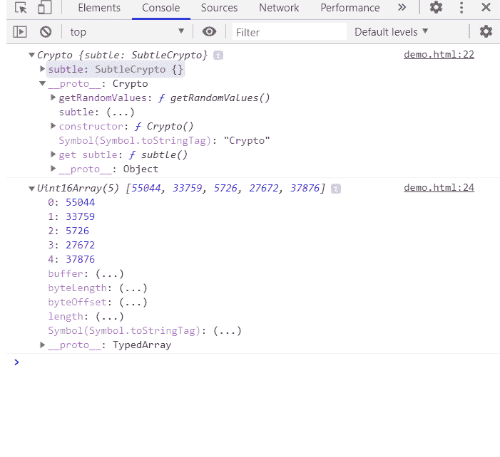

# HTML DOM 窗口加密属性

> 原文:[https://www . geesforgeks . org/html-DOM-window-crypto-property/](https://www.geeksforgeeks.org/html-dom-window-crypto-property/)

属性返回与全局对象相关的**加密**对象。这是只读属性。此对象允许网页访问某些加密相关服务。这个加密对象提供了一些访问方法，exp getRandomValues()方法。

**语法:**

```html
var *cryp* = window.crypto or window.msCrypto;
```

**值:**该属性返回加密对象的一个实例。

**示例:**本示例使用 crypto 属性及其 getRandomValues()方法生成大小为 5 的随机数组。

```html
<!DOCTYPE HTML> 
<html>  
<head>
    <title>window crypto property</title>
</head>   
<body style="text-align:center;">
    <h1 style="color:green;">  
        GeeksForGeeks  
    </h1> 
    <p> 
    HTML | Window.crypto property
    </p>
    <button onclick = "Geeks();">
    click here
    </button>
    <p id="arr"> 
    </p>       
    <script> 
        var arr = document.getElementById("arr");
        function Geeks() {
            var array = new Uint16Array(5);
            console.log(window.crypto);
            a = window.crypto.getRandomValues(array);
            console.log(a);
            arr.innerHTML = "The random array is: "+a;
        } 
    </script> 
</body>   
</html>
```

**输出:**

**点击按钮前:**



**点击按钮后:**



**同样**，**在** **控制台中的加密对象是:**



**支持的浏览器:**

*   谷歌 Chrome
*   边缘
*   火狐浏览器
*   旅行队
*   歌剧
*   微软公司出品的 web 浏览器