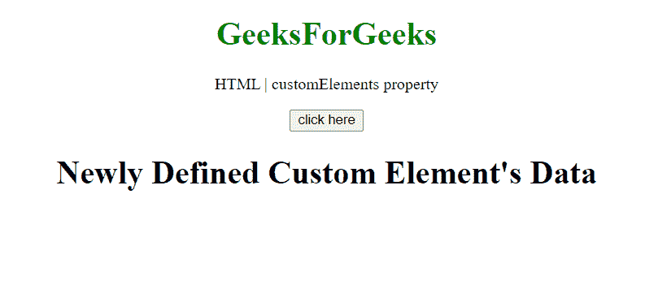

# HTML DOM 窗口 customElements 属性

> 原文:[https://www . geesforgeks . org/html-DOM-window-customelements-property/](https://www.geeksforgeeks.org/html-dom-window-customelements-property/)

**customElements** 属性返回对 CustomElementRegistry 对象的引用，该对象可进一步用于注册新的自定义元素，并因此获得关于先前注册的自定义元素的信息。

**语法:**

```html
var obj = window.customElements;
```

**返回值:**

*   **自定义元素注册对象:**该属性返回一个对象，该对象包含已定义的自定义元素的详细信息。

**示例:**在本例中，我们将获得关于自定义元素的信息，并将**使用 **define()** 方法创建**自定义元素。

```html
<!DOCTYPE HTML> 
<html>  
<head>
    <title>customElements property</title>
</head>   
<body style="text-align:center;">
    <h1 style="color:green;">  
        GeeksForGeeks  
    </h1> 
    <p> 
    HTML | customElements property    
    </p>
    <button onclick = "Geeks();">
    click here
    </button>
    <p id="arr"> 
    </p>       
    <script> 
        var arr = document.getElementById("arr");
        function Geeks() {
          let customElementRegistry = window.customElements;
          class CustomTitle extends HTMLElement {
              constructor() {
                super()
                this.attachShadow({ mode: 'open' })
                this.shadowRoot.innerHTML = `
                <h1>Newly Defined Custom Element's Data</h1>
                    `
                      }
                }
        window.customElements.define(
                'custom-title', CustomTitle);
        console.log(customElementRegistry)
        } 
    </script> 
    <custom-title></custom-title>
</body>   
</html>
```

**输出:**

**按钮点击前:**


**按钮点击后:**



**客户元素对象:**


**支持的浏览器:**

*   谷歌 Chrome
*   边缘
*   火狐浏览器
*   旅行队
*   歌剧