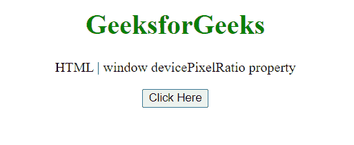
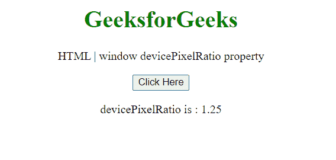

# HTML DOM 窗口 devicePixelRatio 属性

> 原文:[https://www . geesforgeks . org/html-DOM-window-devicepixel ratio-property/](https://www.geeksforgeeks.org/html-dom-window-devicepixelratio-property/)

**devicePixelRatio** 属性返回当前设备的 ***物理像素*** 分辨率与 ***CSS 像素*** 分辨率的比值。更简单地说，这个属性还告诉浏览器应该使用多少屏幕实际像素来绘制单个 CSS 像素。这是只读属性。

**语法:**

```html
*value* = window.devicePixelRatio;
```

**返回值:**返回一个双精度浮点值，表示显示器的物理像素分辨率与 CSS 像素分辨率的比值。

**示例:**在本例中，我们将使用该属性获得比率。

```html
<!DOCTYPE HTML> 
<html>  
<head>
    <title>window devicePixelRatio property</title>
</head>   
<body style="text-align:center;">
    <h1 style="color:green;">  
        GeeksforGeeks  
    </h1> 
    <p> 
    HTML | window devicePixelRatio property
    </p>
    <button onclick = "Geeks()">
    Click Here
    </button>
    <p id="a"> 
    </p>       
    <script> 
        var a = document.getElementById("a");
        function Geeks() {
        a.innerHTML="devicePixelRatio is :
               "+window.devicePixelRatio; 
        } 
    </script> 
</body>   
</html>
```

**输出:**

**点击按钮前:**



**点击按钮后:**在标准变焦设备下，像素倍率为 1.25



**支持的浏览器:**

*   谷歌 Chrome
*   边缘
*   火狐浏览器
*   旅行队
*   歌剧
*   微软公司出品的 web 浏览器