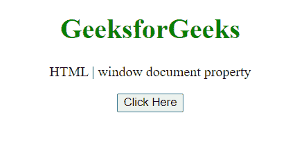
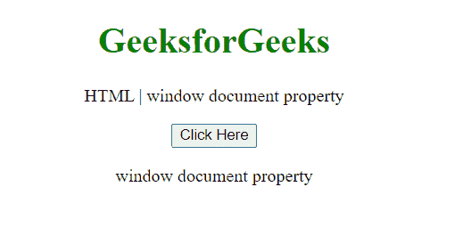
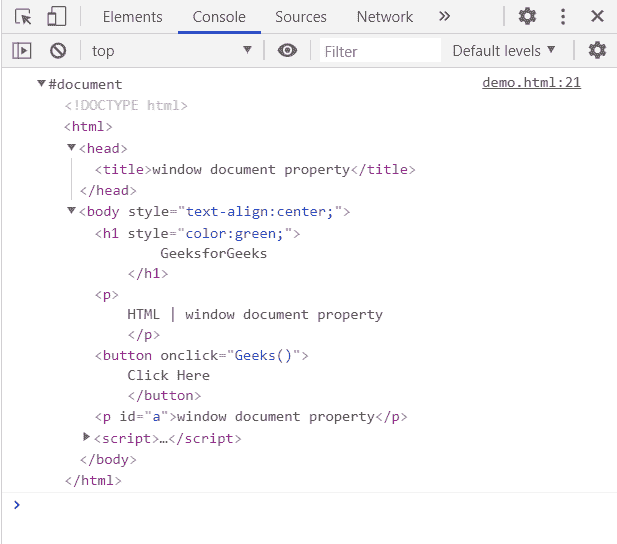

# HTML DOM 窗口文档属性

> 原文:[https://www . geesforgeks . org/html-DOM-window-document-property/](https://www.geeksforgeeks.org/html-dom-window-document-property/)

**窗口文档**返回对当前窗口中包含的文档的引用。

**语法:**

```html
doc = window.document;
```

**返回值:**该属性返回对文档的引用。

**示例:**在本例中，我们将使用该文档引用获取文档的标题。

```html
<!DOCTYPE HTML> 
<html>  
<head>
    <title>window document property</title>
</head>   
<body style="text-align:center;">
    <h1 style="color:green;">  
        GeeksforGeeks  
    </h1> 
    <p> 
    HTML | window document property
    </p>
    <button onclick = "Geeks()">
    Click Here
    </button>
    <p id="a"> 
    </p>       
    <script> 
        var a = document.getElementById("a");
        function Geeks() {
            console.log(window.document)
            a.innerHTML=window.document.title; 
        } 
    </script> 
</body>   
</html>
```

**输出:**

**点击按钮前:**



**点击按钮后:**



**在控制台中，文档引用为:**



**支持的浏览器:**

*   谷歌 Chrome
*   边缘
*   火狐浏览器
*   旅行队
*   歌剧
*   微软公司出品的 web 浏览器