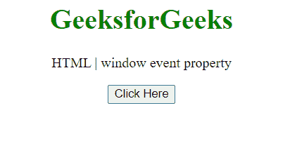
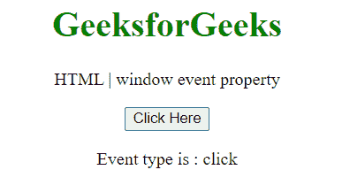
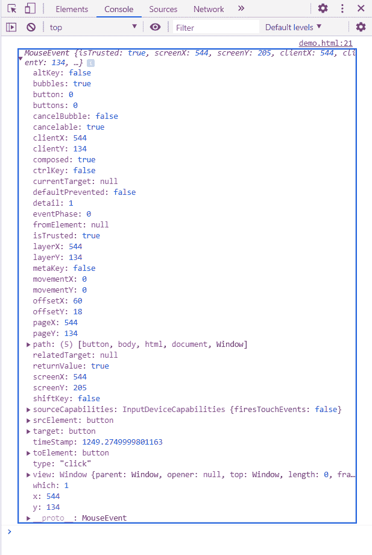

# HTML DOM 窗口事件属性

> 原文:[https://www . geesforgeks . org/html-DOM-window-event-property/](https://www.geeksforgeeks.org/html-dom-window-event-property/)

窗口**事件**属性返回当前窗口中站点代码当前正在处理的事件。

**语法:**

```html
event = window.event;
```

**返回值:**该属性返回当前正在处理的事件对象。

**示例:**在本例中，我们将使用该属性获取事件类型。

```html
<!DOCTYPE HTML> 
<html>  
<head>
    <title>window event property</title>
</head>   
<body style="text-align:center;">
    <h1 style="color:green;">  
        GeeksforGeeks  
    </h1> 
    <p> 
    HTML | window event property
    </p>
    <button onclick = "Geeks()">
    Click Here
    </button>
    <p id="a"> 
    </p>       
    <script> 
        var a = document.getElementById("a");
        function Geeks() {
            console.log(window.event)
            a.innerHTML="Event type is : "+window.event.type; 
        } 
    </script> 
</body>   
</html>
```

**输出:**

**点击按钮前:**



**点击按钮后:**



**在控制台中，事件对象为:**



**支持的浏览器:**

*   谷歌 Chrome
*   边缘
*   火狐浏览器
*   旅行队
*   歌剧
*   微软公司出品的 web 浏览器