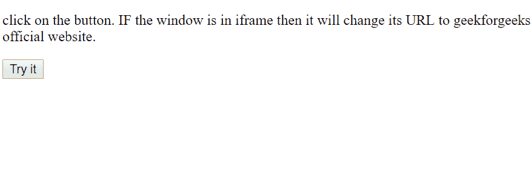

# HTML | DOM 窗口框架元素属性

> 原文:[https://www . geesforgeks . org/html-DOM-window-frame element-properties/](https://www.geeksforgeeks.org/html-dom-window-frameelement-properties/)

HTML**DOM Window frame element**属性返回嵌入或存储窗口的 iframe 元素。如果没有存储，在这种情况下，它只返回一个空值。

**语法:**

```html
window.frameElement
```

**返回值:**返回一个 IFrame 对象或空值。

**示例:**

```html
<!DOCTYPE html>
<html>

<head>
    <title>
        HTML | DOM Window frameElement Properties
    </title>

</head>

<body>

    <p>
      click on the button. IF the window is in
      iframe then it will change its URL to 
      geekforgeeks official website.
    </p>

    <button onclick="myFunction()">
        Click!
    </button>

    <script>
        function myFunction() {
            var iframe = window.frameElement;
            //  IF WINDOW IS NOT EMBEDDED 
            //  THEN IFRAME WILL HAVE A NULL VALUE.

            if (iframe) {
                iframe.src = 
            "https://ide.geeksforgeeks.org/";
            }
        }
    </script>

</body>

</html>
```

**输出:**

**点击前:**

**点击后:**


**支持的浏览器:***DOM Window frame element Properties*支持的浏览器如下:

*   谷歌 Chrome 18.0
*   Internet Explorer 2.0
*   FireFox 1.0
*   歌剧 11.5
*   Safari 6.0