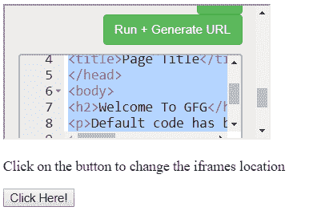

# HTML | DOM 窗框属性

> 原文:[https://www . geesforgeks . org/html-DOM-window-frames-properties/](https://www.geeksforgeeks.org/html-dom-window-frames-properties/)

HTML DOM 中的 **Window frames 属性**用于以数组对象的形式返回框架元素。该属性表示当前窗口中的所有< iframe >元素。DOM Windowframe 是一个只读属性。

**语法:**

```html
window.frames
```

**返回值:**返回对 Window 对象的引用，代表当前窗口中的所有帧。

**属性:**

*   **length property:** It returns the number of iframe elements in the current window.
    **Syntax:**

    ```html
    window.length
    ```

    **示例:**

    ```html
    <!DOCTYPE html>
    <html>

    <head>
        <title>
            HTML | DOM Window frames Property
        </title>
    </head>

    <body>

        <iframe src = "https://ide.geeksforgeeks.org/tryit.php">
        </iframe><br>

        <p>
            Click on the button to display
            the number of iframes
        </p>

        <button onclick="myGeeks()">
            Click Here!
        </button>

        <p id = "GFG"></p>

        <!-- script to count iframes -->
        <script>
            function myGeeks() {
                var x = window.length;
                document.getElementById("GFG").innerHTML = x;
            }
        </script>
    </body>

    </html>                    
    ```

    **输出:**
    **之前点击按钮:**
    
    **之后点击按钮:**
    

*   **location property:** It changes the location of iframe.
    **Syntax:**

    ```html
    window.frames[index_no].location
    ```

    **例 2:**

    ```html
    <!DOCTYPE html>
    <html>

    <head>
        <title>
            HTML DOM Window frames Property
        </title>
    </head>

    <body>

        <iframe src = "https://ide.geeksforgeeks.org/tryit.php">
        </iframe><br>

        <p>
            Click on the button to display
            the number of iframes
        </p>

        <button onclick = "myGeeks()">
            Click Here!
        </button>

        <p id = "GFG"></p>

        <!-- script to count iframes -->
        <script>
            function myGeeks() {
                window.frames[0].location = 
                "https://ide.geeksforgeeks.org/index.php";
            }
        </script>
    </body>

    </html>                    
    ```

    **输出:**
    **之前点击按钮:**
    
    **之后点击按钮:**
    

**支持的浏览器:***DOM 窗框属性*支持的浏览器如下:

*   谷歌 Chrome
*   微软公司出品的 web 浏览器
*   火狐浏览器
*   歌剧
*   旅行队