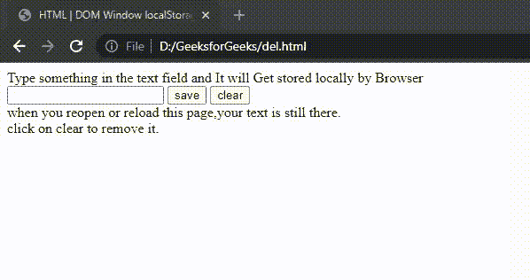

# HTML DOM 窗口本地存储属性

> 原文:[https://www . geesforgeks . org/html-DOM-window-local storage-properties/](https://www.geeksforgeeks.org/html-dom-window-localstorage-properties/)

HTML DOM **窗口 localStorage** 属性允许您使用对象在网络浏览器中存储值对。它是一个**只读**

**属性**。即使关闭浏览器，该对象也不会过期。所以，数据永远不会丢失。

**返回值:**返回一个存储对象。

**语法:**

*   **将数据保存到本地存储，使用:**

    ```html
    localStorage.setItem("key", "value");
    ```

*   **使用:**从本地存储读取数据

    ```html
    var name = localStorage.getItem("key");
    ```

*   **使用:**从本地存储中删除数据

    ```html
    localStorage.removeItem("key");
    ```

**示例 1:** 本示例描述了将数据保存、读取和删除到本地存储。

## 超文本标记语言

```html
<!DOCTYPE html>
<html>

<head>
    <title> HTML DOM Window localStorage Properties </title>
    <script>

    //Saving data locally
    function save() {
        var fieldValue = document.getElementById('textfield').value;
        localStorage.setItem('text', fieldValue);
    }

    // Reading data
    function get() {
        var storedValue = localStorage.getItem('text');
        if(storedValue) {
            document.getElementById('textfield').value = storedValue;
        }
    }

    // Removing stored data
    function remove() {
        document.getElementById('textfield').value = '';
        localStorage.removeItem('text');
    }
    </script>
</head>

<body onload="get()">
    <p1>
        Type something in the text field and 
        It will Get stored locally by Browser 
     </p1>
    <input type="text" id="textfield" />
    <input type="button" value="save" onclick="save()" />
    <input type="button" value="clear" onclick="remove()" />
    <p2>
        when you reopen or reload this page,
        your text is still there.
    </p2>
    <p3>
        <br>click on clear to remove it.</p3>
</body>

</html>
```

**输出:**



窗口本地存储

**例 2:** 本例描述检查存储类型，保存数据。

## 超文本标记语言

```html
<!DOCTYPE html>
<html>

<head>
    <title>HTML DOM Window localStorage Properties</title>
</head>

<body>
    <div id="SHOW"></div>
    <script>
    if(typeof(Storage) !== "undefined") {
        localStorage.setItem("name", "GeeksforGeeks");
        document.getElementById("SHOW").innerHTML = 
        localStorage.getItem("name");
    } else {
        document.getElementById("SHOW").innerHTML = 
        "YOUR BROWSER DOES NOT" + "SUPPORT LOCALSTORAGE PROPERTY";
    }
    </script>
</body>

</html>
```

**输出:**


窗口本地存储属性

**支持的浏览器:****DOM Window local storage**支持的浏览器如下:

*   谷歌 Chrome 4.0
*   Internet Explorer 8.0
*   微软边缘 12.0
*   Firefox 3.5
*   歌剧 10.5
*   Safari 4.0