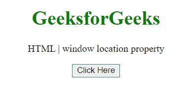
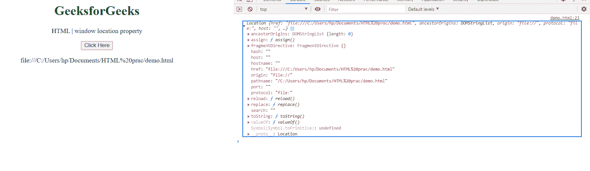

# HTML DOM Window.location 属性

> 原文:[https://www . geesforgeks . org/html-DOM-window-location-property/](https://www.geeksforgeeks.org/html-dom-window-location-property/)

属性返回一个包含文档当前位置信息的位置对象。Window.location 是只读属性。

**语法:**

```html
var loc = window.location;
```

**返回值:**包含文档位置信息的对象。

**示例:**此示例显示了如何使用该属性获取文档的位置。

## 超文本标记语言

```html
<!DOCTYPE HTML>
<html>

<body style="text-align:center;">

    <h1 style="color:green;">
        GeeksforGeeks
    </h1>

    <p>
        HTML | window location property
    </p>

    <button onclick="Geeks()">
        Click Here
    </button>

    <p id="a"></p>

    <script>
        var a = document.getElementById("a");
        function Geeks() {
            a.innerHTML = window.location;
            console.log(window.location);
        }
    </script>
</body>

</html>
```

*   **点击按钮前:**

    

*   **点击按钮后:**在控制台中，可以看到位置对象。

    

**支持的浏览器:**

*   谷歌 Chrome
*   边缘
*   火狐浏览器
*   旅行队
*   歌剧