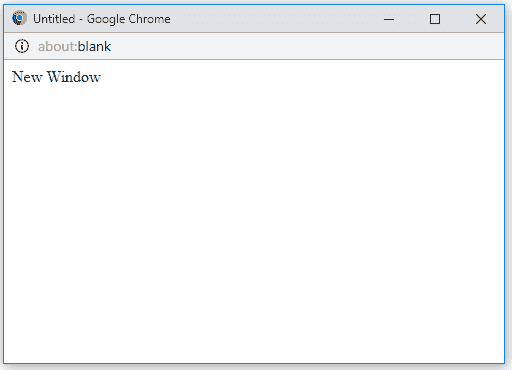

# HTML | DOM 开窗器属性

> 原文:[https://www . geesforgeks . org/html-DOM-开窗器-属性/](https://www.geeksforgeeks.org/html-dom-window-opener-properties/)

HTML DOM 中的**窗口打开器属性**用于返回新创建窗口的引用。此属性用于返回源(父)窗口的详细信息。窗口使用 window.open()方法打开，使用 window.opener.close()方法关闭。

**语法:**

```html
window.opener
```

**返回值:**返回已创建窗口的引用。

**例 1:**

```html
<!DOCTYPE html>
<html>

<head>
    <title>
        HTML DOM Window opener Property
    </title>
</head>

<body>

    <h2>
        HTML DOM Window opener Property
    </h2>

    <button onclick = "myGeeks()">
        Click Here!
    </button>

    <!-- script to open new windows -->
    <script>
        function myGeeks() {
            var win = window.open("", "win",
                        "width = 500, height = 300");

            win.document.write("<p>New Window</p>");

            win.opener.document.write("<p>Parent Window</p>");
        }
    </script>
</body>

</html>                                    
```

**输出:**
**点击按钮前:**

**点击按钮后:**



**例 2:**

```html
<!DOCTYPE html>
<html>

<head>
    <title>
        HTML DOM Window opener Property
    </title>
</head>

<body>

    <h2>
        HTML DOM Window opener Property
    </h2>

    <button onclick = "myGeeks()">
        Click Here!
    </button>

    <!-- script to create two window -->
    <script>
        function myGeeks() {
            var win1 = window.open("", "win1", 
                    "width = 500, height = 300");

            var win2 = window.open("", "win2",
                    "width = 400, height = 250");

            win1.document.write("<p>New Window 1</p>");
            win2.document.write("<p>New Window 2</p>");

            win1.opener.document.write("<p>Parent Window</p>");
            win2.opener.document.write("<p>Parent Window</p>");
        }
    </script>
</body>

</html>                    
```

**输出:**
**之前点击按钮:**

**之后点击按钮:**


**支持的浏览器:***DOM 开窗工具属性*支持的浏览器如下:

*   谷歌 Chrome
*   微软公司出品的 web 浏览器
*   火狐浏览器
*   歌剧
*   旅行队