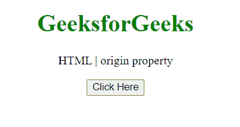
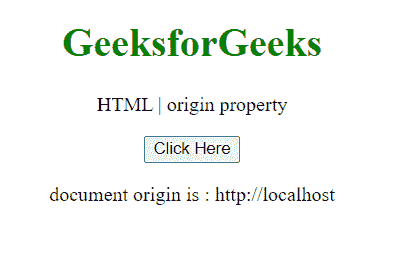

# HTML DOM 窗口原点属性

> 原文:[https://www . geesforgeks . org/html-DOM-window-origin-property/](https://www.geeksforgeeks.org/html-dom-window-origin-property/)

窗口 **原点** 属性返回全局范围的原点，序列化为窗口的字符串。

**语法:**

```html
var origin = self.origin;
```

**返回值:**包含原点的字符串。

**示例:**这个示例展示了如何使用这个属性获取文档的原点。

## 超文本标记语言

```html
<!DOCTYPE HTML>
<html>

<body style="text-align:center;">
    <h1 style="color:green;">
        GeeksforGeeks
    </h1>

    <p>
        HTML | origin property
    </p>

    <button onclick="Geeks()">
        Click Here
    </button>

    <p id="a"></p>

    <script>
        var a = document.getElementById("a");
        function Geeks() {
            a.innerHTML = "document origin is : "
                    + self.origin;
        } 
    </script>
</body>

</html>
```

**输出:**

**点击按钮前:**



**点击按钮后:**



**注意:** 如果原点不是一个方案/主机/端口元组(假设你试图在本地运行，即通过文件:// URL)，原点属性将返回字符串“null”。

**支持的浏览器:**

*   谷歌 Chrome
*   边缘
*   火狐浏览器
*   旅行队
*   歌剧