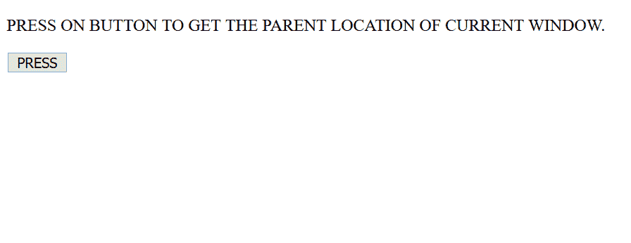
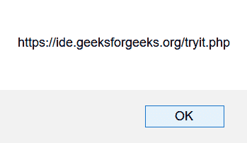

# HTML | DOM 窗口父属性

> 原文:[https://www . geesforgeks . org/html-DOM-window-parent-property/](https://www.geeksforgeeks.org/html-dom-window-parent-property/)

HTML DOM **窗口父项**属性返回当前窗口的父窗口。这是一个**只读**属性。
如果一个窗口没有父窗口，那么它就是指它自己。

**语法:**

```html
window.parent
```

**返回值:**

*   当前窗口的父窗口对象。如果没有父窗口，则它引用自身。

**示例:**使用警报返回**父窗口**。

```html
<!DOCTYPE html>
<html>

<head>
    <title>
        HTML | DOM Window parent Property
    </title>
</head>

<body>

    <p>
      PRESS ON BUTTON TO GET THE PARENT
      LOCATION OF CURRENT WINDOW.
    </p>

    <button onclick="myFunction()">
        PRESS
    </button>

    <script>
        function myFunction() {

            // An alert of parent window.
            alert(window.parent.location);
        }
    </script>

</body>

</html>
```

**输出:**

**点击前:**


**点击后:**


**支持的浏览器:***DOM Window 父属性*支持的浏览器如下:

*   谷歌 Chrome
*   微软公司出品的 web 浏览器
*   火狐浏览器
*   歌剧
*   旅行队