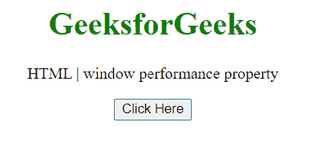
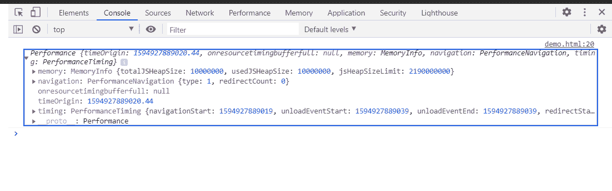

# HTML DOM 窗口性能属性

> 原文:[https://www . geesforgeks . org/html-DOM-window-performance-property/](https://www.geeksforgeeks.org/html-dom-window-performance-property/)

**性能** 属性返回一个性能对象，可以进一步用来收集当前单据的性能信息。

**语法:**

```html
var per = window.performance
```

**返回值:**返回一个性能对象。

**示例:**本示例展示了如何使用该属性获取文档的性能对象。

## 超文本标记语言

```html
<!DOCTYPE HTML>
<html>

<body style="text-align:center;">
    <h1 style="color:green;">
        GeeksforGeeks
    </h1>

    <p>
        HTML | window performance property
    </p>

    <button onclick="Geeks()">
        Click Here
    </button>

    <script>
        function Geeks() {
            console.log(window.performance);
        }
    </script>
</body>

</html>
```

**输出:**

*   **点击按钮前:**

    

*   **点击按钮后:**在控制台中，可以看到性能对象。

    

**支持的浏览器:**

*   谷歌 Chrome
*   边缘
*   火狐浏览器
*   旅行队
*   歌剧
*   微软公司出品的 web 浏览器